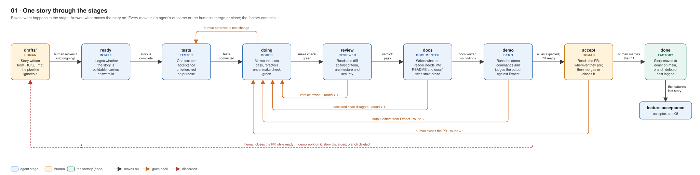

# factory

A file-based delivery pipeline for small repositories: features and their user stories are Markdown files in Git, one stage agent at a time builds a story (tests first, then code, review, docs, demo), and the human accepts by merging a pull request from wherever they are. Nothing runs permanently; a tick every couple of minutes evaluates the repository and starts a headless dispatcher only when a line needs a hand.

This repository is the engine. A repository that wants to be built by it carries only configuration (see *What a repository needs*). `docs/decisions.md` records why the factory is the way it is, decision by decision.



## Try it

`demo/README.md` lets the factory build a FastAPI to-do service into an empty repository of yours. You set the machine up, give Claude Code one prompt, and watch eight stories go through tests, code, review, documentation and demo on their pull requests. It takes about an hour and a half and roughly 15 USD of API usage.

## Parts

- `src/factory/` — the deterministic side: `watch` (what should happen next, one line), `tick` (runs the watcher, handles the line it gets, records costs), `dispatch` (what each line does: bookkeeping on the story and its pull request), `stage` (one stage run: the branch and pull request before the agent, its outcome, lane, checks and commit after it), `ops` (what both share), `agent` (starts an agent headless from its file), `github` and `repo` (the gh and git steps), `guard` (the write-lane hook), `costs`, `preflight`. `story` (the story format and its check, `factory-check-story <path>`). Installed as `factory-watch`, `factory-tick`, `factory-guard`, `factory-costs`, `factory-preflight`, `factory-check-story`.
- `claude/` — the model side: the rules every agent works by (`factory-rules`), a stage skill per stage and a role skill per role, the seven agents (intake, tester, coder, reviewer, documenter, demo, acceptor), and the permission allow list. Installed at user level in the container, so every repository under it sees them.
- `docs/diagrams/` — how a story moves through the stages and lanes, how a finished feature is accepted, how the container, the tick, the watcher and the preflight drive it, and the branches, as SVG with a short explanation each.
- `docs/branching.md` — one trunk, one short branch per ticket, merge commits only; `docs/github-settings.md` — the GitHub settings that keep it so, for the factory and for every repository it builds.
- `docs/WATCH_CONTRACT.md` — what the watcher must do; `claude/skills/factory-rules/SKILL.md` — the rules.
- `docs/backlog.md` and the plans beside it — what is open; `docs/archive/` — plans that were built or withdrawn, history only.
- `Dockerfile`, `compose.yml`, `entrypoint.sh` — the machine. The container clones the repositories in `REPOS` into a volume, keeps them current, and ticks them in turn.
- `demo/`, `scripts/demo-check.sh` — the demo: a project skeleton and three features of stories, the instructions for the Claude Code session that plays the human, and a check of the machine before it starts. Its hardening mode is how the factory itself is tested.
- `template/` — what a new repository starts from: `stages.yml`, the story and feature forms, `CLAUDE.md`, an app-first `README.md` and a `Makefile`.

## Running it

```bash
cp .env.example .env        # REPOS (owner/repo, comma-separated) and GH_TOKEN
docker compose build
docker compose run --rm -it --entrypoint claude factory   # once: complete the login, then /exit
docker compose up -d
docker compose logs -f
```

The checkouts live in the `work` volume, the login in `claude-home`; `docker compose down -v` forgets both. Tick records (minutes, turns, tokens, dollars per agent run) are in each checkout's `.git/factory-tick.log` and `.git/factory-dispatches.jsonl`.

## What a repository needs

- `factory/stages.yml` — stages, transitions, lanes (glob patterns each agent may write to). Copy `template/stages.yml`.
- `factory/TICKET.md` — the story form; `factory/FEATURE.md` — the feature form. Copy both from `template/`.
- `factory/features/<F0001-slug>/` — one folder per feature with its `FEATURE.md` and its stories, `F0001-S0003-slug.md`, in `drafts/` (yours, not read by anything), `ongoing/` (the pipeline's; `git mv` a draft here to start it — `mkdir` the folder first if it is empty, git does not keep empty folders — no frontmatter needed) or `done/` (the archive; the dispatcher moves a story here when its pull request is merged). Stories run in id order, lowest first, so the feature with the lowest number goes first and inside it the lowest story. A feature is complete when `ongoing/` and `drafts/` are empty; the acceptor then judges it as a whole (scope, a feature demo, mutation score, what the stories noticed, the documentation) in a pull request with `ACCEPTANCE.md` and proposed draft stories; merging takes them into `drafts/`. The folder stays, new stories can arrive later.
- `CLAUDE.md` — the project: architecture, test layout, docs layout, checks. Start from `template/CLAUDE.md`.
- `README.md` and `docs/` — the project's documentation, written for its readers, not for the pipeline; the documenter stage keeps them current from each story's docs criterion. Start from `template/README.md`.
- A `Makefile` with `check`, `lint` and `test` — the whole contract between the project and the pipeline. `template/Makefile` is a Python example.
- A GitHub repository with pull requests, and `uv` for the project's own environment (the only tool assumption left; it goes when the second language arrives).

## Developing the engine

`uv sync`, then `make check` (ruff, mypy --strict, pytest). The watcher's routing is a pure function and is tested without git; the git-backed parts use throwaway repositories under `tmp_path`.

## Licence

MIT, see `LICENSE`.
