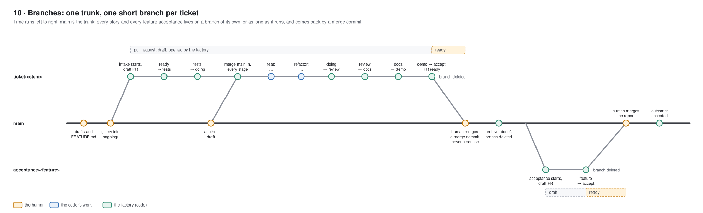

# Branching

Trunk-based: `main` is the only long-lived branch. Each story, and each feature's acceptance, runs on a short branch of its own and comes back into `main` through its pull request, merged by the human with a merge commit. There are no feature branches. Why it ended up this way is in `docs/decisions.md` (2026-10-03, 2026-10-04 and the trunk-based entry of 2026-10-05).

## The branches

| Branch | Holds | Created by, from | Ends |
| :- | :- | :- | :- |
| `main` | everything accepted; the human's drafts and promotions; the dispatcher's bookkeeping | — | never |
| `ticket/<file stem>`, e.g. `ticket/F0001-S0003-search` | one story, from intake to the human's decision | intake, from `main`, together with a draft pull request | deleted by the dispatcher after the merge, or after a close that discards the story |
| `acceptance/<feature>` | one feature's acceptance report and its proposed drafts | the acceptor, from `main`, together with a draft pull request | deleted by the dispatcher after the merge or the close |

One ticket is in flight at a time (WIP 1). At most one `ticket/` or `acceptance/` branch is therefore being worked on; others exist only while they wait for the human.

## Who commits where

| Where | Who | What |
| :- | :- | :- |
| `main` | the human | `FEATURE.md`, stories in `drafts/`, the `git mv` that promotes one into `ongoing/`, an answer as a log entry when no pull request exists yet |
| `main` | the human, on GitHub | the merge commit of a pull request: accepting a story or an acceptance report |
| `main` | the dispatcher | one commit per event: archiving a merged story into `done/`, discarding a story back to `drafts/`, recording an acceptance's `outcome` |
| `ticket/…`, `acceptance/…` | the coder | its work commits, as it goes (`ticket <id>: feat(…): …`) |
| `ticket/…`, `acceptance/…` | the dispatcher | the branch's first commit (the story's frontmatter, or the report's head); merging `main` in before every stage; after every stage one commit with the agent's work, the story and its log entry, and the push; bookkeeping (a stall, an expired run, copied pull request comments) |
| `ticket/…`, `acceptance/…` | the tick | the leftovers of an interrupted run, committed as they are |

Nothing else writes to `main`. No agent commits there, and no agent pushes anywhere.

## How a story's branch runs

1. The human promotes the story on `main`.
2. The dispatcher branches `ticket/<stem>` off `main`, writes the story's frontmatter, pushes and opens a draft pull request; then intake checks the story.
3. Before every later stage, the dispatcher pulls the branch (fast-forward only) and merges `origin/main` into it, so each stage builds on the current trunk. If that merge conflicts, it is aborted and the stage counts as stalled.
4. After each stage the dispatcher commits and pushes. A forward move waits for the stage's checks in `stages.yml` (`make check`; at `tests` only `make lint`, because the new tests are red on purpose).
5. When the demo passes, the dispatcher writes the pull request body from the story and marks it ready. At `accept` the human merges it, which is the acceptance, or closes it, which sends the story back to the coder on the same branch and the same pull request.
6. After the merge, the dispatcher archives the story on `main` and deletes the branch, locally and on GitHub.

A pull request closed before `accept` discards the story: its file goes back to `drafts/` on `main`, untouched by the pipeline, and the branch is deleted. The feature acceptance follows the same path on `acceptance/<feature>`; its outcome is recorded on `main` either way.

## Rules that keep this working

- **Merge commits only.** A squash merge puts the whole branch into one ordinary commit on `main`, in which the story jumps from `ready` to `accept`. The watcher reports that as an illegal stage change (`reject … ready accept`), and the dispatcher would move the merged story back (checked on 2026-10-05). The watcher exempts only real merge commits. Rebase merging is untested. Allow merge commits only (see `docs/github-settings.md`).
- **No history rewriting on shared branches.** No force push to `main` or to a ticket branch. The dispatcher pulls with `--ff-only`; a rewritten branch makes the stage stall.
- **Pushing to a ticket branch by hand** is possible between stages: the next stage pulls it. While a stage runs it makes that stage's push fail, and the stage stalls.
- **A merged branch is ignored.** When a branch's tip is already in `main`, the watcher reads the story from `main`, however long the branch ref lingers.
- **The feature acceptance is not a gate on `main`.** By the time a feature is complete, its stories are on `main`; the acceptance's `outcome` is the feature's status and, later, the release gate.

## Settings on GitHub

Merge methods, the ruleset for `main`, tokens and the account settings are in `docs/github-settings.md`.
