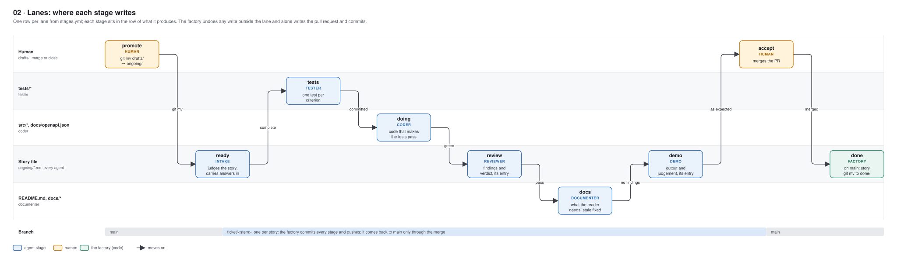
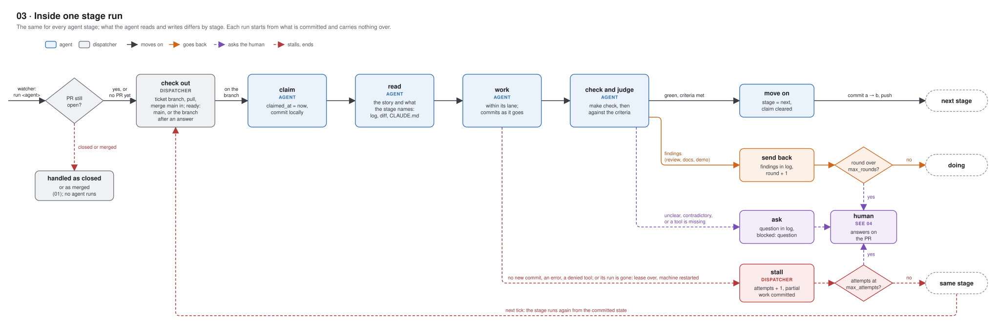
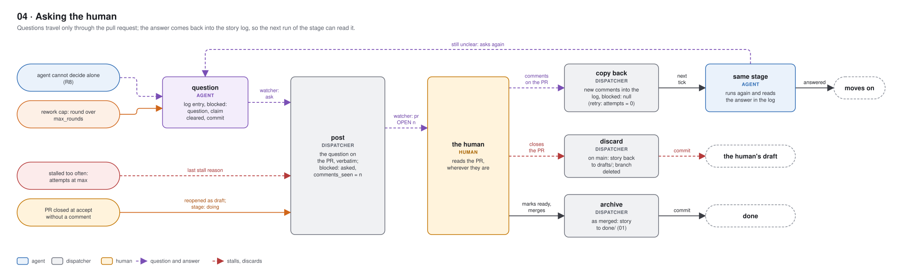
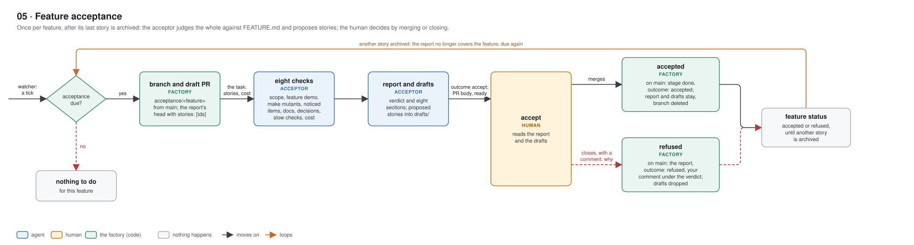
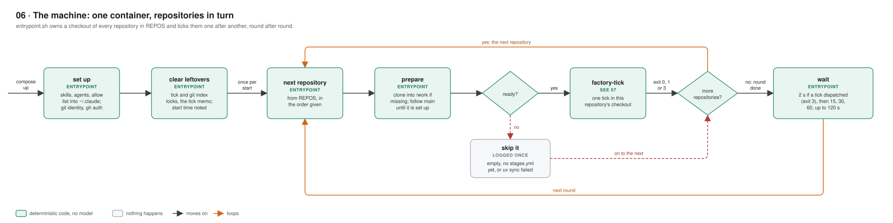
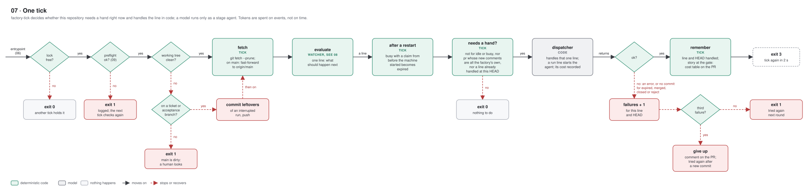
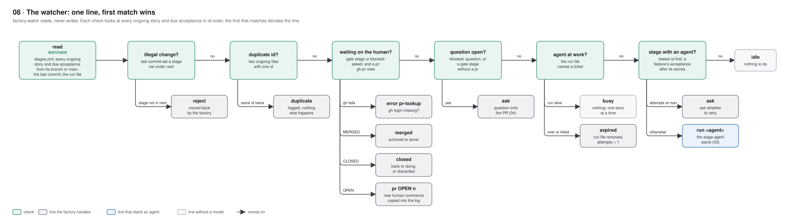
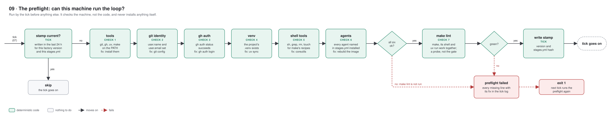

# Diagrams

How one story moves through a repository's build, how a finished feature is accepted, and the frame that drives both. Boxes say what happens, arrow labels say what triggers the move; read left to right. Each diagram carries its own legend: blue is an agent, the only place a model runs; amber is the human; green is the factory's own code (the tick, the watcher, the dispatcher). In 08, grey marks a line the factory handles. The text under each heading holds what the picture leaves out. Click a diagram to open it at full size. The diagrams follow the viewer's light or dark mode (`prefers-color-scheme`) and bring their own background in both, so they stay readable even where a page's theme and the system's differ.

The SVGs are generated: change `draw.py`, then run `uv run python docs/diagrams/draw.py`. Every position is set by hand, so a new box needs room made for it.

## One story in a build

### 01 · Stages

- Every arrow is an agent's outcome, or the human's merge or close, applied and committed by the factory, which checks it against `next` in `stages.yml`. A stage change made by hand outside that is rejected by the watcher and moved back.
- Every way back ends in `doing`, and the story runs the main line again from there. `round` counts all returns together; once it passes `max_rounds` (2), the stage asks the human instead (04).
- Closing the pull request at `accept` sends the story back with your comment as the coder's reason. Without a comment, the dispatcher asks first (04).
- Closing it earlier discards the story: the dispatcher checks the pull request before every stage starts. A merge before `accept` counts as acceptance.
- Failing sides are part of the story: intake asks when a rule in the Interface has no criterion for the input it rejects, the tester tests every stated limit on both sides, and the reviewer names a missing failing-side criterion as a finding against the story.
- When the archived story was the feature's last (nothing left in `ongoing/` or `drafts/`), the feature's acceptance is due (05).

### 02 · Lanes

- A lane is a list of glob patterns under `lanes:` in `stages.yml`. Every agent may also write its own story file. A hook on each agent (`factory-guard <agent>`) refuses an edit outside its lane, and after the stage the factory undoes any other write outside it, including one from the shell, which the hook does not see.
- No lane reaches the human's files: `.claude/`, `CLAUDE.md`, `Makefile`, `pyproject.toml`, `uv.lock`, `factory/stages.yml`, `factory/TICKET.md` and every `FEATURE.md`. No story stage writes `drafts/` or `done/`; only the dispatcher moves a story between folders.
- The acceptor (05) has a lane of its own: the feature's `ACCEPTANCE.md` and new files in `drafts/`, on its branch. They reach `drafts/` on `main` only when the human merges.
- The pull request, the frontmatter, the log's numbering and every commit but the coder's work are the factory's. No agent pushes or calls `gh`; `claude/settings.json` denies both.
- Rework rounds and questions are not drawn here; they write in the same lanes.

### 03 · One stage run

- The acceptor (05) runs the same way: like intake its branch and draft pull request are opened by the dispatcher first.
- The agent's task names the story, its stage, the allowed outcomes, the branch, the pull request and the round, plus what the stage needs: the format check's result for intake, the mode for an approved test change, the archived stories and their cost for the acceptor.
- The agent ends with an outcome (a stage from `next`, `question` or `stuck`) and its log entry; it never commits the stage change, pushes or calls `gh`. The dispatcher undoes writes outside the lane, keeps the frontmatter and the log its own, and commits and pushes.
- A forward outcome waits for the stage's `checks` in `stages.yml`: `make check` after `doing` and `docs`, `make lint` after `tests` (whose new tests are red on purpose). Red holds the story and counts as a stall.
- An agent that hits its budget is resumed once to give its outcome; a run that ends without a kept outcome is a stall.
- Stalls and rework rounds have separate counters: `attempts` (cap `max_attempts`, 2) and `round` (cap `max_rounds`, 2). Every stall is also a comment on the pull request.

### 04 · Asking the human

- `blocked: question` means an agent ended with `question` and the factory recorded it, or the factory asked itself (the round cap, a close at `accept` without a comment); `blocked: asked` means it is on the pull request. Only while a question is asked does the watcher read the pull request outside `accept`.
- Your three answers:
  - Comment: copied into the log, and the stage that asked runs again. After a close at `accept` that is the coder. After the attempts cap, any comment is a retry and resets `attempts`.
  - Close: discards the story. Your original text goes back to `drafts/`, and the branch is deleted.
  - Mark ready and merge: accepts the story as it is.
- Intake runs again on its existing branch and writes your answer into the story, citing the log entry.
- At `accept`, a comment without a close is only recorded; no stage runs there to answer it.

## One feature

### 05 · Feature acceptance

- Due when the feature has stories in `done/`, none in `ongoing/` or `drafts/`, and no `ACCEPTANCE.md` whose `stories` list matches the archived ones. The report's file is the acceptance's ticket: the six fields plus `stories`, its own branch `acceptance/<feature>`, its own pull request.
- It runs after the feature's stories in id order (`F0001-S0009 < F0001-todo-service`), and like any stage it can ask, stall or be retried (03, 04).
- The eight checks: scope against `FEATURE.md`, a feature demo run end to end, `make mutants` with the survivors grouped, everything the stories logged as "noticed, not touched", the documentation read as a whole, the decisions taken for the human, slow checks, cost.
- Verdict: `accepted`, `accepted with drafts` or `not accepted`, with reasons. It is a recommendation; your merge or close decides, and the dispatcher records it as `outcome` in the report.
- The proposed stories follow `TICKET.md`, one per coherent change. After a merge they are your drafts: refine them and promote what you want. Nothing starts by itself.
- A close keeps the findings: the report goes to `main` with your comment as the reason, and the next acceptor reads it. Only the proposed drafts are dropped; your comment is the brief for the stories you write instead.
- The acceptance is not a gate on `main`: the stories' code is already there, merged one at a time. `outcome` is the feature's status. `factory-watch --board` shows it per feature as `-`, `due`, `running`, `accepted` or `refused`, and a later release stage will ship only accepted features.

## The frame around it

### 06 · The machine

- A single container (`compose.yml`): checkouts live in the `work` volume, the Claude login in `claude-home`.
- After a restart, whatever ran before was killed. Its locks would idle the repository for lease + 10 minutes, so they go; the start time lets the tick expire a run started before it (07).
- Repositories are ticked one after another, never in parallel. `docker stop` ends the wait at once; a running tick finishes first.

### 07 · One tick

- State lives under `.git/`, never tracked: `factory-tick.lock`, `factory-tick.json` (last line, HEAD, failures), `factory-preflight-ok`, `factory-tick.log`, and `factory-dispatches.jsonl` (turns, tokens and dollars per agent run).
- The lock is released at the end of every tick. A lock older than lease + 10 minutes belongs to a dead tick and is removed.
- The dispatcher is code (`factory.dispatch`); a model runs only for a `run` line, as the stage agent: `claude -p` with the agent file's model, tools, effort and skills passed as flags, the lane guard as a hook, permission mode `auto`, no permission prompts, and the agent's budget as `--max-budget-usd`. A run stopped by its budget is resumed once to hand back. Whatever would have prompted is denied, and the denial is reported on the pull request.
- Exit 3 makes the entrypoint tick again after 2 seconds: the next stage is probably due. After that the pause starts at 15 seconds and doubles up to 120 (`TICK_FIRST_SECONDS`, `TICK_SECONDS`), because what comes next is usually the human, who tends to act right after the factory did.
- Leftovers of an interrupted run are committed on a `ticket/` or `acceptance/` branch; on `main` the tick stops and waits for a human.

### 08 · The watcher

- The order of the checks is the contract in `docs/WATCH_CONTRACT.md`. `evaluate()` is a pure function, tested without git or GitHub.
- One ticket at a time: while `.git/factory-run.json` names a story or acceptance, the line is `busy` before anything else can run. Ids sort feature by feature, story by story, then the feature's acceptance: `F0001-S0001 < F0001-S0002 < F0001-todo-service < F0002-S0001`.
- A due acceptance is listed with stage `feature` before its `ACCEPTANCE.md` exists; `run acceptor <path> main` follows, and the factory writes the report's head before the acceptor starts.
- A ticket is read from its branch (`ticket/…` or `acceptance/…`), else from `origin/main`, else from the working tree. A branch already merged into `main` counts as gone.
- The watcher only reads: no fetch (the tick fetches), no commit, no checkout, no model. It looks into `drafts/` and `done/` only for the acceptance rule and to count them for the board.

### 09 · The preflight

- All six checks run every time, so the log names everything missing at once. A check whose tool is missing counts as missing too.
- "agents" covers every agent `stages.yml` names, the acceptor included: a repository whose stage table is newer than the image fails here, not halfway through a feature.
- `make lint`, not `make check`: a ticket branch may be red on purpose, and the probe judges the machine, not the code.
- The fix lines are per platform (apt, dnf, brew, winget). Nothing installs them, and nobody is asked: the human reads the tick log.

## Branches

### 10 · Branches

- One trunk, one short branch per ticket, merge commits only. `docs/branching.md` explains it, including who commits where and why a squash merge breaks the watcher.
- Every commit on a ticket branch is the factory's but the coder's work commits: one when the story starts (frontmatter, draft pull request), one per stage change, and a merge of `main` whenever it moved. A clean story has seven, plus the coder's.
- The GitHub settings that keep it so are in `docs/github-settings.md`.
