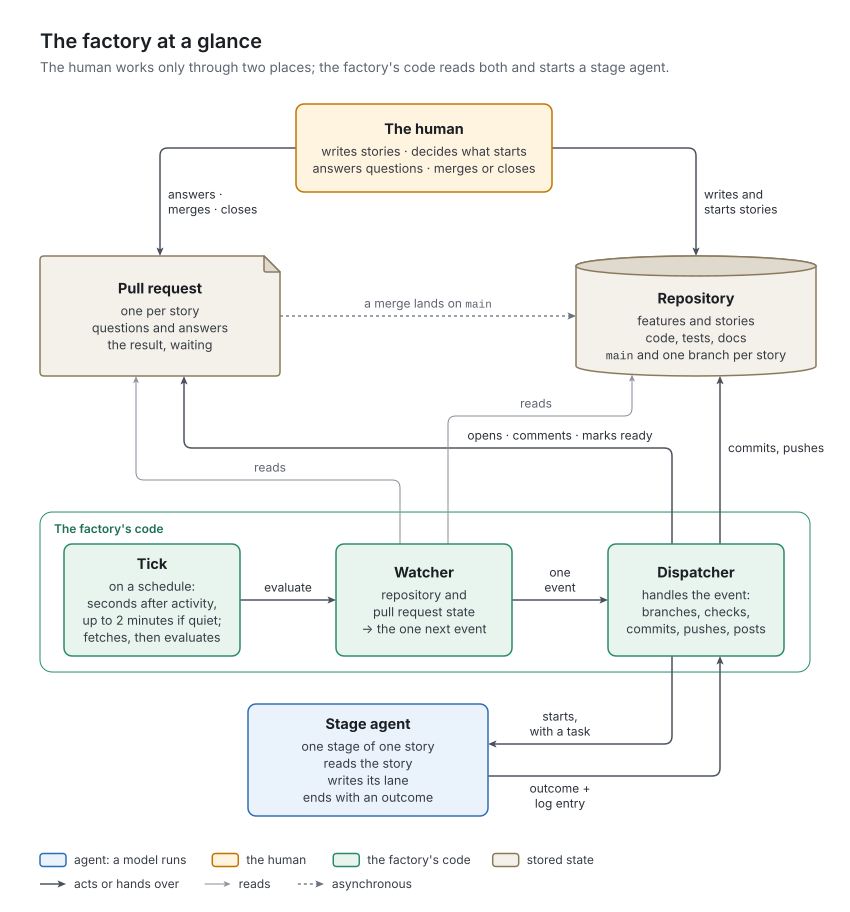
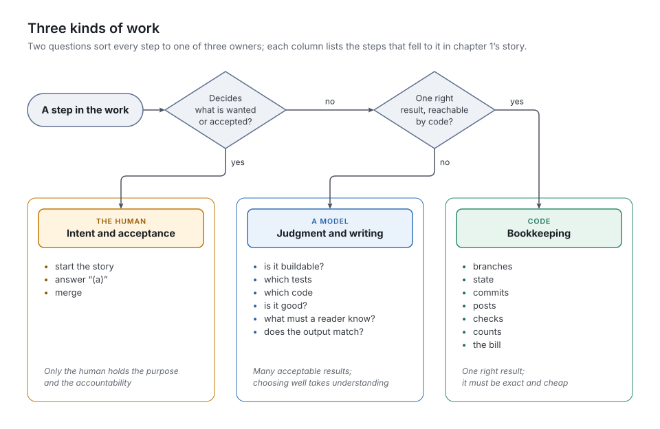

# 1. Why a factory

A capable coding agent, given a clear task, a repository and a test runner, will usually come back with code that works. That part is no longer the hard part. The hard part starts with the second task, and the tenth, and the fortieth. Who decides what gets built next? Who remembers what the last session learned? Who checks the agent's claim that the tests pass? Who notices when it stops halfway at three in the morning? And who knows what all of it cost?

This book describes *the factory*: a small production system around coding agents that answers those questions. The person it works for does not have to watch. They start a story by promoting it and accept the result by merging its pull request, from wherever they are. We call that person **the human** throughout: the factory is a pattern, not one person's tool.

## What an agent session does not give you

An interactive session with a coding agent is a remarkable tool, and it is the wrong unit of production. It was built for a person who sits beside it, reads along and steers. Take the person away and five gaps open up, one for each of the questions above.

| Gap | In an agent session | What the factory does instead |
| :- | :- | :- |
| *Control* | The agent decides what "done" means and what is in scope. Scope drifts toward whatever is interesting. | The human starts every story and accepts every result. Agents are told to ask rather than decide a product question, and a finished feature's acceptance lists any they decided anyway ([chapter 11](../11-feature-acceptance/README.md)). |
| *Memory* | The context ends with the session. The next session starts blank, or from a summary the agent wrote for itself. | The story is the memory. Each stage appends to the story's log what it did, why, what it rejected and what is open, and the story lives in version control ([chapter 4](../04-work-items/README.md)). |
| *Independent verification* | The author judges its own work. Tests get written to fit the code, the reviewer is the writer, and "the tests pass" is a sentence in the chat. | Separate roles, instructions and write permissions. Tests come first, from a tester. The reviewer writes no code. The factory runs the checks itself ([chapters 5](../05-stage-machine/README.md) and [9](../09-agents-and-skills/README.md)). |
| *Continuity* | Someone has to be there. A stalled session is silent, and a crashed one is forgotten. | A scheduler evaluates the repository again and again. A restart recovers by itself. Every stall becomes a message where the human already looks ([chapters 7](../07-dispatcher/README.md) and [14](../14-runtime/README.md)). |
| *Economy* | Cost shows up on the monthly bill, unattributed. | Every agent run is recorded with its time, tokens and dollars. Each story carries its own bill ([chapter 14](../14-runtime/README.md)). |

None of these gaps is about the quality of the model; the runs at the end of this chapter show it.

## The idea in one paragraph

Features and their user stories are text files in a version-controlled repository. A story moves through a fixed sequence of stages (vet the story, write the tests, write the code, review, document, demonstrate), and each stage is done by a fresh agent with a narrow role, its own instructions and a short list of files it may change. Between the stages, ordinary code works out what happens next, keeps the books, enforces the rules and talks to the outside world. The human writes the stories, decides which to start and in what order, answers the questions the stages raise, and accepts each result by merging a pull request.

*Figure 1-1. The factory at a glance: the human works through the repository and the pull request; the factory's code reads both, keeps the books, and starts a stage agent when a stage is due.*

A *scheduler* wakes the factory's code again and again, and each wake-up is a *tick*. In a tick, a *watcher* reads the repository and its pull requests and names the one next thing to do, and a *dispatcher* does it: bookkeeping, or starting a stage agent.

## One story through the factory

Here is one real story, from the fourth end-to-end run of the factory's first implementation, which built a small to-do service. The story asked for a health endpoint: `GET /health` should report the service's status, its version and which storage it uses, without touching the database. In that run a Claude Code session played the human; everything else happened as told here.

The human moved the story's file from the feature's drafts into production and pushed; that was the whole of starting it. Two minutes later a tick fetched the repository, and the watcher named the next thing to do: a new story is ready for its first stage. The dispatcher opened a branch for the story, wrote its state into it, opened a draft pull request and started the first stage agent.

That agent, *intake*, judged whether the story could be built, and found a gap. The story's interface said that an empty storage setting means in-memory storage, but no acceptance criterion tested that case, so nobody would. Intake did not guess. It ended with a question offering two options, extend criterion 3 or add a new criterion, and recommended the first. The dispatcher posted the question on the pull request. Twenty-seven seconds later the answer came back as a comment: "(a)". On the next tick the dispatcher copied the answer into the story's log; on the tick after, seconds later, it started intake again. Intake wrote the answer into criterion 3, cited the log entry it came from, and accepted the story.

Then the stages ran one after another, each a fresh agent:

- the *tester* wrote tests for the five testable criteria, all red because the code did not exist yet; the dispatcher confirmed the tests were at least clean (lint green) and recorded the red test run;
- the *coder* made the tests pass, refactored once, and wrote down its main design choice and the alternative it rejected; the dispatcher ran the project's full check: green;
- the *reviewer* read the diff against the criteria and the architecture and found nothing to send back;
- the *documenter* added a section on the endpoint to the API documentation and a line to the README, and ran its example against a live server;
- the *demo* agent ran the story's demonstration command and compared the output with the expected line the human had written before any code existed.

The dispatcher then wrote the pull request's description from the story, marked it ready for the human, and posted the bill: seven agent runs, 2.8 minutes of agent time, $1.36. The human merged. On the next tick the dispatcher archived the story on the main branch and deleted its branch. From promotion to archive took ten minutes.

Look at who did what. Every judgment in that story was made by a model: is it buildable, which tests, which code, is it good, what must a reader know, does the output match. The human's decisions were three: start it, (a), merge. Everything else (branches, state, commits, posts, checks, counts, the bill) was code.

## What the factory is not

The word "factory" invites a few misreadings.

- **It is not autonomous.** Nothing starts without the human. Agents may propose stories, never start them, and work reaches the main branch only through the human's merge. The factory removes the human from the keyboard, not from the human's decisions.
- **It does not turn a prompt into an app.** A story is a precise specification: an exact interface, numbered acceptance criteria including what must fail, and a demonstration with expected output. The factory rewards that precision and refuses its absence: the first stage asks instead of guessing.
- **It is not continuous integration.** It runs checks, like CI. But CI verifies what people produce, and the factory produces.
- **It is not a conversation between agents.** Agents never talk to each other. They meet only in the repository: in the story, where each writes down what the next one needs, and in the work the last one left.
- **It is not tied to a language, a hosting service or an agent runtime.** Its first implementation, which this book calls *v1*, runs on Python, GitHub and Claude Code, and its first project was a FastAPI service. That project is an example, not an assumption: a project in Go or TypeScript keeps the same stages behind its own toolchain, and a library, a data pipeline or infrastructure code may need other stages. Everything in this book comes in two layers: the general concept, which any implementation must keep, and v1's instance of it, which the next one may change.

## Three kinds of work

The idea in one paragraph contains a division of labor, the core of the design: every step in producing software belongs to one of three kinds of work, and two questions sort it.

*Does the choice decide what is wanted, or whether a result is accepted?* Then it is **intent and acceptance**, and it belongs to the human. Two of the human's decisions bind the project:

- what should exist: this story, now, with these criteria;
- whether what was built is wanted: merge, or send back.

Both rest on a purpose and an accountability that only the human holds. A machine can propose either. It cannot own either.

*Given the state, is there exactly one right result, and can code reach it without open-ended recovery in the outside world?* Then it is **bookkeeping**, and it belongs to code:

- which story is next;
- which branch it lives on;
- the number of the next log entry;
- whether a stage change is allowed;
- whether the checks are green;
- how many rounds have been spent;
- what to post on the pull request.

*Everything else* is **judgment and writing**, and it belongs to a model. These steps have many acceptable results, and choosing a good one takes understanding:

- Is this story precise enough to build?
- Which tests express this criterion?
- What code satisfies these tests inside this architecture?
- Is this diff good?
- What does a reader need to know now?
- Does this output meet that expectation?

Here language models are strong, and here they earn their cost.

*Figure 1-2. Three kinds of work, the two questions that sort a step into one of them, and the steps from the story above that belong to each.*

The second question has a clause that matters: *without open-ended recovery in the outside world*. Running a story's demonstration looks mechanical, since the commands are written down. But a server that does not stop, or a port already in use, needs someone who can see what went wrong and recover. Code would need a rule for every such case; a model simply handles it. So the demonstration stays with a model, and the clause says why.

Code and models also fail differently, and that is the real reason for the split. When code is wrong, it is wrong the same way every time, so one test reproduces the bug and one fix ends it. A model does a bookkeeping step right almost every time. In v1's runs, one archive entry in seven was written as a bullet instead of the next number, and four reviewers in eight broke the log's numbering with an unindented verdict. At hundreds of steps a day, "almost" means a wrong step every day, each time in a new place.

The natural first design ignores this. It gives a capable model a long instruction list: pick up the story, check out its branch, run the tests, write the code, commit with this subject, push, set the stage, post on the pull request. It works, mostly: the judgment steps come out well, and the bookkeeping steps right most of the time. Bookkeeping that is right most of the time stalls a story every day, quietly, where nobody looks. It is how v1 began, and probably how your first agent pipeline began too.

The failure is not carelessness. A model asked to follow a fifteen-step protocol applies judgment to every step, because judgment is what it does, and judgment applied to a step with one right answer can only make it worse.

## How v1 found its shape

v1 grew in three days out of a single product repository, a small FastAPI to-do service meant to be built by agents, and went through five **generations**, which its decision log calls versions 1 to 5.

| Generation | When (2026) | What moved | What forced the move |
| :- | :- | :- | :- |
| 1 | 3 October | Nothing yet. A long-running agent session coordinated the stages, and a story's stage was the folder its file sat in. | — |
| 2 | 3–4 October | The stage, from the file's location to a field that code reads. Acceptance, from the keyboard to a pull request the human merges from anywhere. | Agents that moved files copied them instead. A transition log asked each stage to record its own commit, which no commit can contain. |
| 3 | 4 October | The loop, from a model session to a schedule that starts a model only when the repository has something to handle. The machine, from a personal computer into a container. | The coordinating session stalled where nobody saw it: the tool it watched the repository with timed out every 30 minutes, and permission prompts waited for nobody. On the computer, `make` was missing, and two agents ran the Makefile's commands by hand and reported the check green. |
| 4 | 4 October | The project's specifics, from the engine's instructions into the project's own files. The engine, into a repository of its own that serves several projects. Flat tickets into features and stories. | One engine was to serve several repositories. A single folder of tickets would soon have hidden the live ones among hundreds of finished ones. |
| 5 | 5 October | All bookkeeping, from the coordinating model to code. Agents end with a structured outcome. | Three end-to-end runs whose defects all sat in the machinery, and the cost of the coordinating model. |

Read backwards, each generation took a responsibility out of a model's hands, or out of a place nobody could see, and gave it to whoever should hold it. Generation 5, which gave all bookkeeping to code, is what Part II describes.

### What the runs showed

Generation 5 came out of evidence. Generation 4 was run end to end against a demonstration project, the to-do service, whose eight stories had been written in advance, and a Claude Code session played the human. Run 1 built all eight, with two questions and two discards provoked on purpose. Run 2 built them again from their final texts, cleanly: no question, no rework. Run 3 walked the paths a clean run never takes. Its first part ran the feature acceptances on run 2's code; its second part promoted stories with deliberate defects and was stopped after four were archived and a fifth had reached the gate. Every failure was treated as a factory defect and fixed at its cause before the run went on. Seventeen turned up:

- **Seven were ordinary bugs in ordinary code.** Among them were a setup script that compared timestamps as strings across time zones, a container that crash-looped on an empty repository and a watcher that decoded output in the wrong encoding. Each was found once, fixed once, and stayed fixed.
- **Five were a model executing a step with one right answer, and getting it wrong.** It second-guessed an expired agent run; it wrote a log entry as a bullet; it misnumbered entries and left a verdict unindented, which broke the log's numbering; it put a new criterion after the two that must close every story; and it accepted a demonstration without its expected output. These did not stay fixed. During run 1 the instructions were corrected to say that an entry takes the next number; in run 2 the coordinating model numbered two entries wrongly anyway.
- **Four were gaps in a protocol that lived in prose.** Only a live run could reveal them, because there was nothing to test.
- **One was a sentence on the pull request** that invited questions nobody would answer.

The second-guessing shows the pattern best. In a restart test, the coordinating model was told that a stage's agent run had expired. It checked the start time itself, found it 36 seconds old, concluded the lease had not run out, and did nothing. The run had expired because the machine had restarted, which only the tick knew; the story would have waited until someone noticed.

None was an agent's judgment failing at its actual work. Product bugs did get past single stages, and a later stage caught each of them. In run 3 the reviewer of the HTTP API story caught that the schema's published maximum length applied before the API stripped the title, and sent the story back; the first feature's acceptance found a crash on malformed text no story had named. Meanwhile, the model that carried out the protocol cost $0.78 of a clean story's $1.87.

Generation 5 moved that protocol into code. In run 4, the first on generation 5, a clean story cost $1.16 on average. The $0.71 saved is close to the coordinating model's $0.78. All eight stories of run 4, with their reworks and questions, averaged $1.50. [Chapter 16](../16-evidence/README.md) has the full record.

> [!WARNING]
> **v1 limit:** the evidence is narrow:
> - one project (a small FastAPI service);
> - stories written in advance by the factory's author;
> - a simulated human;
> - one machine.
>
> The commit this book describes has had no full run of its own. Its last code changes ran on one story and two feature acceptances after run 4.

## What comes next

The factory, then, is a division of labor made executable: the human decides, models judge and write, code keeps the books. Chapter 2 names the parts, following the health-endpoint story further, and chapter 3 states the principles that hold them together.

> [!IMPORTANT]
> **Planner:** what this chapter fixes for any implementation.
> - **Requirements.** Any implementation must close the five gaps: control, memory, independent verification, continuity, economy. The gap table is the requirements list.
> - **The sorting rule** (P1 in [chapter 3](../03-principles/README.md)): no step with one right result is left to a model, and no step that decides what is wanted is left to anyone but the human.
> - **Two places, one direction.** The human works in exactly two places: the work-item store, to write and start stories, and the pull request, to answer, accept and send back. Agents never communicate directly; everything between stages passes through the repository, and the story carries what the next stage must know.
> - **The main branch.** "Nothing lands without the human" applies to *work*. The factory itself commits bookkeeping to the main branch (an archive, a discard, a refusal record); [chapter 13](../13-git-and-github/README.md) lists those commits.
> - **Baselines from run 4:**
>   - a clean story takes about six agent runs, two to four minutes of agent time and seven to nine minutes from promotion to archive (under run 4's two-minute pause between ticks);
>   - it costs about $1.16;
>   - a feature acceptance costs $0.87 to $1.59.
>
>   These numbers come from the narrow evidence named above.
> - **Incidental to v1:** Markdown, Git, GitHub, `make`, Python, Claude Code, Docker and the specific stages. Each is one choice behind a general concept ([chapter 2](../02-concepts/README.md) maps them).
