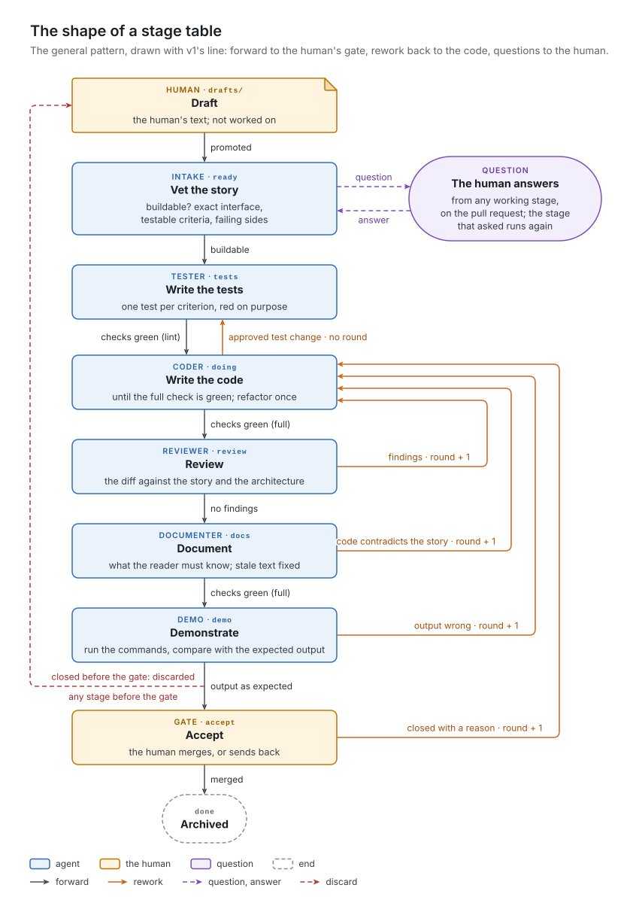
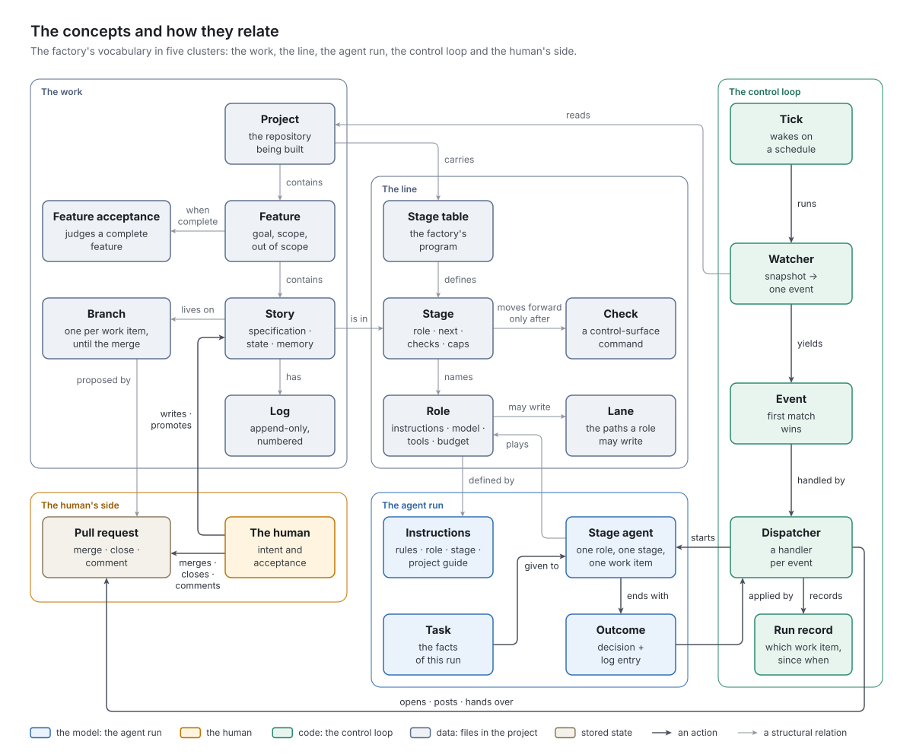

# 2. Concepts

Chapter 1 followed the health endpoint through the factory. This chapter names the concepts that story met, in the order it met them.

Every concept here is general; the story's file names, folder names and numbers are v1's, and only examples.

## The work

### Project, feature, story

A **project** is the repository the factory builds: its code, tests and documentation, and the files that tell the factory how to work on it. The factory never owns a project. It is a guest with a narrow set of permissions, and the project's own files say how it is built.

The human plans the work as **features**: coherent pieces of value, each with a goal, a scope and an explicit *out of scope*. The health endpoint belongs to *Operations*, whose goal is "an operator can tell from outside whether the service is up, which version runs and with which storage, and how many todos are open and done". Its scope is a health endpoint, a version command and statistics; its out of scope names metrics export, logging configuration and deployment, so that no story drifts there.

A feature is too large to build in one step and too vague to test, so it is cut into **stories**, the unit of production: each small enough for one pass through the stages, typically a few minutes of agent time and a few dozen to a few hundred lines of change.

### The story as a document

A story is also a document with three jobs.

*Specification.* What to build, and how to know it is built:
- an **assignment**: what to build and why, in a paragraph that always states the story's *current* meaning;
- an **interface**: exact module paths, names, signatures, error types and routes, because the tests are written against it;
- numbered **acceptance criteria**, each testable by one test;
- a **demonstration**: commands to run, each followed by the output it must show.

*State.* Where the story stands: a handful of fields at the top, which only the factory writes (see the state table).

*Memory.* An append-only, numbered **log**, to which every stage, the human and the factory append what was done, why, what was rejected and what is open: it is how one stage tells the next what it needs.

Two criteria close every story: the project's full check stays green, and a **docs criterion** says what a reader must know after this story, if only `none` with a reason. Documentation no criterion asks for does not get written.

The criteria cover the **failing sides** too: errors, limits and rejected inputs. If an interface says a title is at most 200 characters, a criterion says what happens with 201. The health endpoint's first draft missed exactly one: its interface said an empty storage setting means in-memory storage, but no criterion tested it, so the first stage asked.

### Work items

A **work item** is anything that moves through the line: a story, or a feature's acceptance (below). v1 calls every work item a *ticket*: its story form is `TICKET.md`, its story branches are named `ticket/…`, and its rules for agents say "ticket" throughout.

### Order

Features and stories carry **identifiers** that sort: feature `F0002`, story `F0002-S0001` (the health endpoint). The sort order is the only priority: the factory works on the lowest identifier first, feature by feature, story by story, and a feature's acceptance sorts after its stories. The human controls the order completely, by numbering and by choosing what to start.

### Two coordinates: lifecycle and stage

A story has two coordinates.

Its **lifecycle** says whose it is, and the factory shows it by location:
- A **draft** is the human's text; the factory does not work on it.
- The human **promotes** a draft to start it, and the story is then **in production**. In v1, promoting means moving the file into the feature's `ongoing/` folder and pushing.
- When the human accepts the result, the factory **archives** the story (in v1, into `done/`).
- If the human abandons the story, the factory **discards** it: the file goes back among the drafts untouched, so the human's text survives.

Only a story in production has the second coordinate, its *stage*: where it is on the line. Promotion sets no stage; the first stage starts from there. Archiving sets the last stage and moves the story into the archive in the same commit.

A feature is **complete** when it has archived stories and nothing else: no drafts, nothing in production.

### A branch per work item

From its first stage to its acceptance, a story lives on a **branch** of its own. Its work, state and log are committed there, and the **main branch** sees none of it until the human merges: a merge is acceptance, and a discard deletes the branch. The health endpoint lived on `ticket/F0002-S0001-health-endpoint` for eight minutes.

### The state of a story in production

Six facts describe a story in production completely, all kept in its state fields.

| State | Values | Changes when | Resets when |
| :- | :- | :- | :- |
| *stage* | one of the stages in the stage table | the factory applies an agent's decision or the human's merge or close; a change the table does not allow is moved back | — |
| *pull request* | its number, once opened | the factory opens it before the first stage | — |
| *question* | none · *recorded* · *posted* | *recorded* when an agent asks or the factory needs the human; *posted* once it is on the pull request | back to none when the human's answer is copied into the log |
| **comments read** | how many comments on the pull request the factory has taken in | whenever the factory reads or posts | — |
| *rounds* | a count | each time a stage sends the story back for rework, and each time the human sends it back at the gate | never; it is capped instead (see below) |
| *attempts* | a count | each time a stage ends without a result the factory can keep | when the human answers the question the attempt cap raised |

## The line

### Stages

A promoted story moves through **stages**, states in which at most one role acts. The sequence of stages is **the line**. The line v1 ships with:

| Stage (v1 key) | Role | What happens |
| :- | :- | :- |
| Vet the story (`ready`) | intake | Is it buildable: an exact interface, testable criteria, failing sides, a runnable demonstration, within the feature's scope? |
| Write the tests (`tests`) | tester | One test per criterion, written before the code exists, red on purpose |
| Write the code (`doing`) | coder | Until the tests pass and the full check is green; refactor once |
| Review (`review`) | reviewer | The diff against the story, the architecture and security |
| Document (`docs`) | documenter | What the reader must know now; stale documentation fixed |
| Demonstrate (`demo`) | demo | Run the story's commands, compare the output with what the story expects |
| Accept (`accept`) | none: a gate | The human merges, or sends the story back |
| Archived (`done`) | none: the end | — |
| Judge the feature (`feature`) | acceptor | Once per complete feature (see *The feature's acceptance*) |

### The stage table

The stages, their roles and the moves allowed out of each are not code but configuration: a **stage table** the project carries. The stage table is the factory's program. For each stage it says:

| Entry | Meaning |
| :- | :- |
| *role* | Who works in this stage. A stage without a role is either a gate or the end of the line. |
| *gate* | Marks a stage where the human, not an agent, decides. A **gate** is declared explicitly; a missing role alone does not make one. |
| *next* | The stages the story may move to. The first entry is the **forward** move; the others are moves **back**, to a stage that can fix what was found. |
| *checks* | Project commands that must succeed before the factory keeps a forward move. A failing check holds the story where it is. |
| *reports* | Project commands the factory runs after the stage and notes in the log, passing or failing, without holding anything. |
| *max rounds* | How many rework rounds the story may have spent when this stage sends it back, before the human is asked instead. |

A move between stages is a **transition**, with exactly two causes: an agent's decision, applied by the factory, or the human's action on the pull request. A stage change the table does not allow, such as a hand edit or a mistake, is detected and moved back ([chapter 6](../06-watcher/README.md) says how thoroughly v1 detects it).

*Figure 2-1. The shape of a stage table: a forward line from the first stage to the human's gate, moves back to the stage that writes the code, and questions that leave the line for the human.*

The shape in Figure 2-1 is a pattern, not a law. It encodes convictions that [chapter 3](../03-principles/README.md) argues for:
- the specification is vetted before anyone builds;
- tests are written before the code, by someone else;
- review, documentation and demonstration are separate perspectives;
- the human has the last word.

A project of another kind would carry another table from the same parts: a library without a demonstration, a data pipeline with a validation stage, infrastructure code with a plan-and-apply step.

## The control loop

Nobody told the factory that the health endpoint had started. Noticing is the control loop's job.

### Scheduler and tick

Nothing in the factory waits in memory between steps. A **scheduler**, the only permanent part, wakes the factory for each project in turn. One wake-up is a **tick**: fetch the latest state, evaluate it, and handle at most one thing. An idle tick costs a network fetch, plus a hosting-service lookup when a story waits for the human; no model runs. A tick that handled something is followed at once by another, because the next step is usually due; after that, the pause between ticks grows to a ceiling. The tick handles the same event in the same repository state only once.

### Watcher and events

The evaluation is the **watcher**'s job, in two halves. Readers collect a snapshot of the repository and of the pull requests that wait for the human. A pure function turns the snapshot into exactly one **event**: the one next thing to do. The same snapshot always yields the same event, so each case can be tested without a repository or a network. Neither half writes anything.

### Dispatcher

The **dispatcher** handles the event, with one handler per kind:

| Event (first match wins) | What the dispatcher does |
| :- | :- |
| A stage change the table does not allow | Moves it back, and says so on the pull request |
| Two stories with the same identifier | Reports it; nothing moves until the human fixes it |
| A pull request the factory cannot read | Reports it; nothing moves until the hosting service answers |
| A pull request merged | Archives the story on the main branch; deletes its branch |
| A pull request closed | Sends the story back, discards it or records a refusal, depending on the stage |
| New comments on a pull request that waits for the human | Copies them into the log; an answer unblocks the story |
| A question recorded but not yet posted | Posts it on the pull request |
| An agent run in progress | Nothing: an agent is at work |
| An agent run that died | Clears its run record and counts a failed attempt; the stage will run again |
| A stage is due | Runs the stage protocol; the only event that starts a model |
| Nothing | Nothing |

The order is part of the watcher's contract, so a story that waits for the human, at a gate or with a question posted, stops all new work in its project until the human acts.

### Run record, lease and the work-in-progress limit

While an agent works, the factory keeps a **run record** (which work item, since when) with a **lease**, a maximum duration. An agent run older than its lease, or left behind by a machine that restarted, is dead.

The **work-in-progress limit** caps how much is in flight. v1's limit is one agent run per project, and in practice one per machine: the tick waits for its agent, and the machine ticks its projects one after another.

## One stage, one agent run

### Roles and agents

A **role** is a responsibility on the line: intake, tester, coder, reviewer, documenter, demo, acceptor. A role is defined by five things:
- its **instructions**: what to do, what to judge, what never to do;
- the **model** that plays it, and its reasoning effort;
- the **tools** it may use: read, search, edit, write, run commands;
- its **budget**: how much one agent run may cost;
- its *lane*: where in the project it may write (below).

The factory ships the roles, the same for every project except their lanes, which belong to the project's stage table.

A **stage agent** is one fresh agent run: a model playing one role, for one stage, of one work item. It remembers no earlier agent run and talks to no other agent; everything it knows comes from its instructions, its task and the repository.

The **task** is the factory's short message naming everything it already knows:
- the work item and its stage;
- the decisions the stage table allows;
- the branch and the pull request;
- the round;
- whatever facts this stage needs.

When intake ran again after the human's answer, its task said so, and whether the story's form had passed form validation.

### Instructions in layers

Instructions come in layers, so each is written once:
- the **rules** every agent works under: version control is the truth, the story is the memory, ask instead of guessing, touch no other role's files;
- the **role instructions**: what a tester is, what a reviewer checks and in what order;
- the **stage instructions**: the steps of this stage, what the log entry must contain, which decisions mean what;
- the **project guide**: the project's own architecture, test conventions, documentation layout, and its list of things nobody may do without asking. This layer belongs to the project, not to the factory.

v1 calls the first three *skills* and the fourth `CLAUDE.md`, in its agent runtime's terms ([chapter 9](../09-agents-and-skills/README.md)).

### Lanes

A **lane** is the list of paths a role may write. The tester writes tests, the coder writes source code and the files generated from it, the documenter writes prose. Every role that works on a story may also write that story's own document, outside its state fields and log. Some files are in no lane, because they belong to the human:
- the stage table;
- the story form;
- the project guide;
- the build configuration;
- every feature description.

Lanes keep roles honest: a coder that cannot write tests cannot make a failing test pass by changing it. They also limit the damage any one agent run can do. A lane is enforced twice: while the agent works, by refusing the write, and afterwards, by undoing any change outside the lane, however it was made.

### Outcomes

Every stage agent ends with an **outcome**, a small structured answer in a fixed shape, not prose, with two parts:
- the **decision**: one of the stages the table allows next, or `question` (the agent needs the human), or `stuck` (it cannot finish, and says where it stopped);
- the **entry**: the text of the agent's log entry.

The agent decides; the factory applies, through the stage protocol below. Agents do not change a story's state, push or talk to the hosting service. Nor do they commit, with one deliberate exception: a role whose commits are part of what the next role judges may commit its own work. In v1 that is the coder, because the reviewer reads how the work was split into commits. Even the coder never commits a stage change.

### The stage protocol

Around the agent, the factory runs the **stage protocol**, the same steps in the same order for every stage.

Before the agent:
1. Bring the work item's branch up to date with the main branch. At the first stage, create the branch, write the story's state fields, and open a draft pull request.
2. Compose the task.
3. Write the run record.

Then start the agent, and wait for its outcome.

After the agent:
1. Check that the agent is still on its branch.
2. Undo every write outside its lane.
3. Restore the story's state fields and log to what they were.
4. Check the decision against the stage table.
5. Validate the story's form.
6. For a move back, count a round, and ask the human instead once the stage's cap is passed.
7. For a forward move, run the stage's checks, and hold the story if one fails. Run the stage's reports and note their results.
8. Append the entry to the log as the next numbered entry.
9. Commit and push.
10. If the story has reached a gate, write the pull request's description from the story and hand it over to the human.

When the health endpoint's tester ended with `doing`, the factory ran the lint as the stage's check (green) and the tests as its report (red, on purpose), noting both in the log under the tester's entry.

## When a story does not move forward

A line that only goes forward is a line that hides its problems. The factory tells four ways of not moving forward apart, each needing a different response.

| | Rework | Stall | Question | Failure |
| :- | :- | :- | :- | :- |
| *What it is* | A judgment that the work is not good enough | A stage that ended without a result the factory can keep | A stage that needs the human to decide | The factory itself could not handle an event |
| *Who decides* | A role (reviewer, documenter, demo), or the human at the gate | The factory | A role, or the factory at a cap | The factory |
| *What is counted* | rounds, per story | attempts, per story | — | failures, per event and repository state |
| *Cap* | the sending stage's max rounds | the project's max attempts | — | a fixed number of retries |
| *At the cap* | the human is asked | the human is asked whether to retry | (goes to the human at once) | the human is told on the pull request, and retries stop |
| *Reset* | never | by the human's answer at the cap | — | when the repository state changes |

A **rework** sends a story back: the reviewer found a defect, the documenter found the code contradicting the interface, or the demonstration did not show what the story promised. The stage that can fix it, the coder's in v1, runs again with the findings (the latest log entries) in front of it. Each rework costs a **round**. The story has one round counter, shared by every stage that can send it back and by the human's send-back at the gate; each stage compares it with its own cap. Not every move back is a rework: when the human approves a test change, the coding stage returns the story to the tests stage without a round.

A **stall** is a stage that ended without a result the factory can keep:
- the agent ended with `stuck`, crashed, or ran out of budget;
- its agent run died, because the lease ran out or the machine restarted;
- it gave a decision the table does not allow;
- it broke the story's form;
- a forward move met a failing check;
- the factory could not prepare the stage, because the story's branch no longer merges with the main branch.

Each stall counts one **attempt** against the story, whatever the stage, and the stage runs again. At the cap, any answer from the human is a retry. Every stall is also a message on the pull request: a stall only the machine knows about is a stall nobody knows about.

A **question** hands a choice to the human: perhaps the story is ambiguous, a criterion contradicts the interface, a test seems wrong, or the project guide says to ask. The agent ends with `question`, and its entry is the question. The story is then **blocked**, in two steps kept apart so that a crash between them loses nothing: the question is recorded and committed, then posted on the pull request.

A **failure** belongs to the factory, not to the story: a handler meets a situation it was not written for, or the hosting service does not answer, and the tick retries the event on the next tick.

Rounds measure quality, attempts measure reliability, questions measure ambiguity, and failures measure the factory.

## The human's channel

Each work item in production has a **pull request**: the reviewable proposal to merge its branch into the main branch, with a description and comments (GitLab: merge request). It is the one place the human needs to look at or act on work in progress. Each action there has a precise meaning:

| The human… | while the stages work | while a question waits | at the gate |
| :- | :- | :- | :- |
| *merges* | accepts the story as it is | accepts the story as it is | accepts the story; the factory archives it |
| *closes* | discards the story: back to drafts as written, branch deleted | discards the story | with a reason, sends it back to the coding stage (one round); without one, is asked whether to rework, discard or accept |
| *comments* | not read while the stages work | answers the question; the stage that asked runs again | goes into the log, and becomes the reason if the human then closes |

At the gate, the factory writes the pull request's description from the story: the assignment, the criteria, what the tester, reviewer, documenter and demonstration recorded, the commits, and what each of the human's actions will do now. It marks the pull request ready and posts the story's running cost. Everything the factory posts carries a hidden **marker**, so it can tell its own comments from the human's even under the same account.

## The feature's acceptance

When the last Operations story was archived, the feature was complete, and one more work item became due: the **feature acceptance**, with its own stage and role, the **acceptor**, followed by the human's gate, and its own branch and pull request.

The acceptor judges the whole feature, which no single stage saw:
- whether the stories together keep the feature's promise;
- a demonstration of the feature end to end;
- how many deliberately broken versions of the code the tests notice;
- what the stories noticed but did not touch;
- the documentation read as a whole.

It writes a report with a verdict and proposes draft stories for what it found. For Operations the verdict was "accepted with drafts": the demonstration showed the feature's goal end to end, and two drafts followed, one because no test would notice the version number going stale, one for small gaps in the documentation as a whole.

On an acceptance's pull request, the human's actions mean slightly different things:
- *merge* accepts the report, and its proposed drafts land among the feature's drafts, where they are the human's to refine and promote, or not;
- *close* refuses the feature: the report is recorded on the main branch as refused, with the human's reason, and the proposed drafts are dropped.

Either way, the result is the feature's status (v1 records it in the report's `outcome` field). A new acceptance becomes due when another story of the feature is archived. [Chapter 11](../11-feature-acceptance/README.md) has the details.

## The contract with a project

A project the factory builds provides a small, fixed set of things, the **project contract**:

| Part | What it is |
| :- | :- |
| *Stage table* | The stages, roles, transitions, checks, reports, caps and lanes for this project |
| *Story and feature forms* | The sections every story and every feature must have |
| *Project guide* | Architecture, test conventions, documentation layout, the list of things nobody does without asking |
| *Control surface* | A few commands the factory and the agents call to check the project: a full check, a lint, a test run, and optional extras such as a mutation run |
| *Reader documentation* | A README and documentation for the project's own readers, which the documentation stage keeps current |
| *A hosting service* | Somewhere the pull requests live and the human acts on them |

The **control surface** makes the factory independent of languages and toolchains: it never runs a compiler, a test framework or a linter directly, only `check`, `lint` and `test`, and the project decides what they mean. (v1 falls short here: it assumes `uv` in every project; see P15 in [chapter 3](../03-principles/README.md).) In v1 they are `make` targets, because `make` is old, small, and indifferent to the language behind it. The health endpoint met all three: the tests during the tester's work, the lint after it, and the full check after the coder.

## The machine

The factory runs on a **machine**: in v1, a container that holds the tools, the agent runtime and the credentials, and keeps its own checkout of each project. A **preflight** checks the machine before it works:
- the tools are present;
- the identity is set;
- the hosting service is reachable;
- the agents the stage table names are installed;
- the control surface runs.

A missing tool is reported, never worked around: an agent that cannot run the full check does not get to run its parts by hand and call it green.

The machine also keeps the **cost records**: one line per agent run with its duration, tokens and cost, giving each story its bill, broken down by stage. The health endpoint's bill (seven agent runs, 2.8 minutes, $1.36) was summed from them.

## How the concepts fit together

*Figure 2-2. The concepts and how they relate.*

Read Figure 2-2 by its colors:
- *Slate: data.* The work (project, feature, story, log) and the line (stage table, stage, role, lane, check) are files in the project, readable and editable with ordinary tools.
- *Blue: the model.* The agent run is the only place a model appears. It reads that data and hands back an outcome.
- *Green: code.* The control loop is the only thing that writes the story's state, commits, and talks to the pull request.
- *Amber: the human.* The human acts on exactly two things: the story, which they write and start, and the pull request, where they answer and accept.

## Where each concept lives in v1

| Concept | In v1 | Chapter |
| :- | :- | :- |
| Feature | A folder `factory/features/F0002-operations/` with a `FEATURE.md` | [4](../04-work-items/README.md) |
| Story | A Markdown file `F0002-S0001-health-endpoint.md` with YAML frontmatter, fixed sections and `## Log (append only)` | [4](../04-work-items/README.md) |
| Work item | A *ticket*: a story, or a feature's `ACCEPTANCE.md` | [4](../04-work-items/README.md), [11](../11-feature-acceptance/README.md) |
| Lifecycle | The feature's subfolders `drafts/`, `ongoing/`, `done/` | [4](../04-work-items/README.md) |
| Story state | Six frontmatter fields: `stage`, `pr`, `blocked` (`question` or `asked`), `comments_seen`, `round`, `attempts` | [4](../04-work-items/README.md), [5](../05-stage-machine/README.md) |
| Branch per work item | `ticket/<file stem>`, and `acceptance/<feature folder>` for an acceptance | [13](../13-git-and-github/README.md) |
| Format validation | `factory-check-story`, in `factory.story` | [4](../04-work-items/README.md) |
| Stage table | `factory/stages.yml`, `version: 5` of the watcher's contract (`docs/WATCH_CONTRACT.md`); *reports* are called `records` there | [5](../05-stage-machine/README.md) |
| Scheduler and tick | The container's entrypoint loop calling `factory-tick` | [14](../14-runtime/README.md) |
| Watcher and events | `factory-watch`; v1 calls an event a *line*: `reject`, `duplicate`, `error pr-lookup`, `merged`, `closed`, `pr`, `ask`, `busy`, `expired`, `run`, `idle` | [6](../06-watcher/README.md) |
| Dispatcher and stage protocol | `factory.dispatch`, `factory.stage`, `factory.ops` | [7](../07-dispatcher/README.md), [8](../08-stage-run/README.md) |
| Run record and lease | `.git/factory-run.json`; `lease_minutes` in `stages.yml` | [6](../06-watcher/README.md), [14](../14-runtime/README.md) |
| Roles and instructions | Seven agent files and their skills (`factory-rules`, `role-*`, `stage-*`) for Claude Code; the project guide is `CLAUDE.md` | [9](../09-agents-and-skills/README.md) |
| Stage agent | `claude -p`, started headless by `factory.agent` | [8](../08-stage-run/README.md), [9](../09-agents-and-skills/README.md) |
| Task and outcome | A task message composed by `factory.stage`; the outcome as JSON `{outcome, entry}` through `--json-schema` | [8](../08-stage-run/README.md) |
| Lanes | `lanes:` in `stages.yml`; the `factory-guard` hook; the undo after the stage | [8](../08-stage-run/README.md), [15](../15-safety/README.md) |
| Control surface | `make check`, `make lint`, `make test`, and `make mutants` | [12](../12-project-contract/README.md) |
| Pull request | A GitHub pull request, through the `gh` CLI; the marker `<!-- factory -->` | [10](../10-human-at-the-gate/README.md), [13](../13-git-and-github/README.md) |
| Feature acceptance | Stage `feature`, the acceptor agent, `ACCEPTANCE.md` with `stories` and `outcome` | [11](../11-feature-acceptance/README.md) |
| Machine and preflight | A Docker container; `factory-preflight` | [14](../14-runtime/README.md) |
| Cost records | `.git/factory-dispatches.jsonl`; `factory-costs` | [14](../14-runtime/README.md) |

> [!IMPORTANT]
> **Planner:** what this chapter fixes for any implementation.
> - **A story is specification, state and memory in one versioned document.** Its log is append-only and numbered; only the factory writes its state.
> - **Two coordinates: lifecycle and stage.**
>   - Lifecycle: draft → in production → archived, or discarded back to draft.
>   - Only the human promotes; only the factory archives and discards, and only in response to the human's merge, close or answer.
>   - Stage applies only in production.
> - **Six state facts per story in production:** stage, pull request, question (none, recorded, posted), comments read, rounds, attempts.
> - **A branch per work item**, brought up to date before every stage; a merge is acceptance.
> - **The stage table is configuration:** per stage the role, gate (explicit), next (first is forward), checks, reports and max rounds; per project the lease and max attempts; per role the lanes.
> - **Transitions** come only from an agent's decision applied by the factory, or from the human's action.
> - **The watcher** is readers plus a pure evaluation, with fixed precedence: corrections, then the human's signals, then new work. One event per tick. Handling is safe to repeat on the repository; after a kill, a post on the pull request can repeat (P14 in chapter 3).
> - **Work-in-progress.**
>   - Agent runs in flight are limited (v1: one per project, in practice one per machine). v1's watcher contract says the run record enforces this; in the container it matters mainly for agent runs that died.
>   - Anything waiting for the human outranks new work in its project.
>   - Identifiers are the only priority, so a lower identifier can start between two stages of another story.
> - **Agents end with a structured outcome (decision + entry).** Only the factory applies it, through the stage protocol, in order.
> - **Four ways not to move forward** (rework, stall, question, failure), each with its own counter, scope, cap and reset (see the table).
> - **Each human action on a pull request has one meaning** per situation (see the table).
> - **Watch for:** v1's code knows several stage and role names by heart, so its stage table is less configurable than described here. [Chapter 5](../05-stage-machine/README.md) lists every place.
