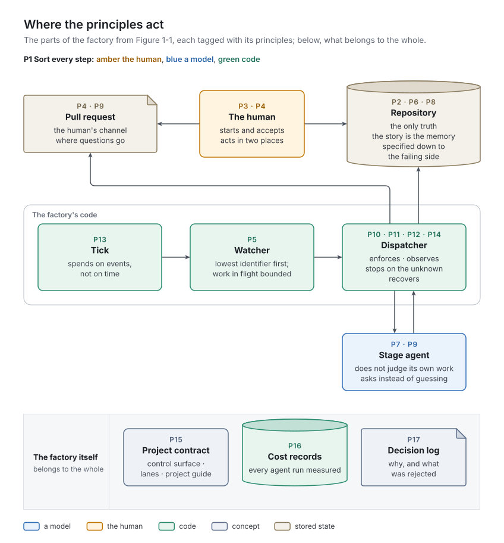

# 3. Principles

Concepts say what the parts are; principles say why they are shaped that way, and they are what a second implementation must keep when it changes everything else. About half of these seventeen were learned the hard way, by watching a simpler design fail in a real run; the rest were first-day convictions the runs tested and did not overturn. [`docs/decisions.md`](../../decisions.md) records each lesson on the day it was learned, and the *In v1* paragraphs cite its design decisions by date and topic.

The families follow chapter 1's division of labor, and the numbers P1 to P17 let later chapters and plans cite them.

| Family | Principles |
| :- | :- |
| *Foundations* | P1 Sort every step: human, model or code · P2 Versioned files are the only truth |
| *The human* | P3 Nothing starts and nothing lands without the human · P4 The human acts where they already are · P5 Bounded work in flight, in the human's order |
| *The models* | P6 The work item is the memory · P7 Whoever makes something does not judge it · P8 Specify first, down to the failing side · P9 Ask, don't guess |
| *The code* | P10 Code enforces, instructions explain · P11 Believe what you observe, not what an agent reports · P12 Loud over lucky · P13 Spend on events, not on time · P14 Recover by construction |
| *The factory itself* | P15 The project owns how it is built · P16 Measure every agent run · P17 Change by evidence, and write down why |

*Figure 3-1. Where the principles act: the parts of Figure 1-1, each with the principles that govern it.*

## Foundations

### P1. Sort every step: human, model or code

**Ask of every step: does the choice decide what is wanted or accepted? Then it is the human's. Given the state, is there exactly one right result, reachable by code without open-ended recovery in the outside world? Then it is code's. Everything else is a model's.**

[Chapter 1](../01-why-a-factory/README.md) tells the evidence: every defect the runs found sat in the machinery, and the bugs in code stayed fixed while the model's protocol errors came back after their instructions were corrected. The fix was not better prose. It was moving every step with one right answer into code, where a test checks it before it runs.

The principle cuts both ways: code should not judge either. Carrying the human's free-text answer into a story's criteria looks like copying, but it maps prose onto a structure, and that is judgment. So is deciding whether an answer calls for a test change. A demonstration stays with a model under the rule's own recovery clause ([chapter 1](../01-why-a-factory/README.md)). In v1 all three stay with models.

*Rules out:* a model doing bookkeeping (counting, numbering, routing, posting, committing, deciding whether a check passed); code interpreting free text.

*In v1:* the dispatcher and the stage protocol are code, and each agent's task names every fact the factory knows (the round, whether this is an approved test change, the form validation's result, the next free story number, the cost so far), so no agent works anything out from version control or the hosting service. v1's plan for this step, [`docs/archive/deterministic-core.md`](../../archive/deterministic-core.md), tabulates where each fault sat; it is history now that it is built, and [chapter 16](../16-evidence/README.md) carries its findings. Design decisions: 2026-10-05 (dispatcher as code; stage protocol as code; story form checked by code).

### P2. Versioned files are the only truth

**Everything that matters about the work lives in version control: what to build, where each piece stands, what was decided and what was learned. The hosting service is an inbox: what the human says there is copied into the work item before the factory acts on it. Everything else is machine state, which is either disposable or rebuilt from the truth.**

v1's second generation kept the factory's control in a long-running agent session, and when the session died, what it knew died with it. State outside version control is state the human cannot see, cannot fix with ordinary tools, and loses with the process that holds it.

So the stage is a field in the story, and a transition is a commit, which records its own time and author. A comment the factory has not copied into the log is one the next stage will not see.

*Rules out:* a database, a dashboard or a long-lived session as the place where a story's status lives; any action taken on a comment before it is in the log.

*In v1:* machine state lives in `.git/`, never committed: the lock a tick holds, the run record (`factory-run.json`), the tick's memo of the last event handled, and the cost records. After a restart the locks and the memo are removed, and the run record left behind expires its agent run. The cost records are neither disposable nor rebuilt. Design decisions: 2026-10-04 (version 3; questions through the pull request), 2026-10-05 (the claim leaves Git).

> [!WARNING]
> **v1 limit:** two shortfalls.
> - The cost records live outside version control, and are lost with the machine ([chapter 14](../14-runtime/README.md)).
> - A comment the human writes while the stages work can be skipped entirely: every post of the factory's own advances the count of comments read ([chapter 7](../07-dispatcher/README.md)).

## The human

### P3. Nothing starts and nothing lands without the human

**The human promotes every story into production and accepts every result. Agents may propose work, never start it, and their output reaches the main branch only through the human's merge.**

Autonomy is not the goal; leverage is. The human's two decisions, *build this now* and *this is what I wanted*, are where intent and accountability live. They take minutes, because the pull request puts all they need on one page. Everything between them is delegated. Even the feature acceptance only proposes *drafts*, for the human to refine and promote, or not. The factory carries out what follows from the human's acts and decides none of it.

*Rules out:* an agent starting a story, creating a feature, or extending a story beyond its assignment; a result reaching the main branch without the human's merge.

*In v1:* promotion is a commit on the main branch that moves a file into `ongoing/`; acceptance is a merge. No story stage's lane reaches `drafts/`. Design decisions: 2026-10-05 (feature acceptance).

> [!WARNING]
> **v1 limit:** nothing in v1's code stops an agent from going beyond its story's assignment. Scope is held by the instructions; the reviewer and the human's merge are the only safeguards.

### P4. The human acts where they already are

**The human works in two places they already use: the repository, where they write and promote stories, and the pull request, where they answer, accept and send back. There is no third.**

The factory runs while the human is elsewhere, so a channel that needs a terminal, a dashboard or a chat session at the right moment is one the human misses. The pull request is already on the human's phone and already carries the code, so it carries the rest too: the story, each question, the result and the bill ([chapter 2](../02-concepts/README.md)). A second conversational channel would split the record: an answer given in a chat never reaches the log, and the agent waiting for it blocks.

*Rules out:* questions in a chat or an email; a dashboard the human must watch; any action the human can only take at a keyboard while the factory works.

*In v1:* code writes everything on the pull request, marked as its own; the description's closing paragraph says what each of the human's actions does at this stage ([chapter 2](../02-concepts/README.md)). Design decisions: 2026-10-04 (a branch per ticket; questions through the pull request), 2026-10-05 (the closing line; the hidden marker).

### P5. Bounded work in flight, in the human's order

**Work is taken in identifier order, and the agent runs in flight are bounded.**

A fixed order gives the human complete control over priority without a priority field. A small bound on agent runs in flight is the strongest simplification of all: with one at a time, every stage builds on the current main branch, one checkout serves every stage, and nothing runs in parallel. The bound is on agent runs, not stories: a story with a lower identifier can start between two stages of another, and the later one's merge of the main branch can then fail, which is a stall.

The price is throughput, paid on purpose. A story takes a few minutes of machine time and then waits for the human's merge, which nearly always takes longer; more stories in parallel would not make the human faster. A higher bound is legitimate for a later implementation, but it reopens what the bound closes: parallel checkouts, conflicts between stories, an order of merges, a shared check.

*Rules out:* a priority field the factory interprets; an unbounded number of agent runs in flight.

*In v1:* one agent run at a time per machine ([chapter 2](../02-concepts/README.md)). A story waiting for the human outranks all new work, so the factory usually finishes one story, then waits for its merge. Design decisions: 2026-10-04 (one checkout, WIP 1), 2026-10-05 (trunk-based stays).

## The models

### P6. The work item is the memory

**Agents remember nothing. A stage starts from the committed state and carries nothing over, and everything a later stage needs is written into the work item by the stage that knows it: what was done, why, what was rejected, and what is open.**

Starting blank is a feature: a fresh agent cannot be confused by a stale context, does not drift, and can be replaced by another model without migration. So the story carries everything forward:
- The tester writes which test covers which criterion, so the reviewer can check the mapping.
- The coder writes its main design choice and the alternative it rejected.
- Every stage writes what it noticed but did not touch, for whoever later sees the whole feature.

When the human's answer changes the story's meaning, the stage that receives it rewrites the assignment and cites the log entry it came from. The story always says what it means *now*; the log says how it got there.

The memory runs one way only. Stories point to code by path and commit; code and tests never name a story or a criterion. A test named `test_criterion_3` says nothing to the next reader.

*Rules out:* agent sessions resumed across stages; summaries kept outside the work item; story numbers in code.

*In v1:* in run 4, the HTTP API story's reviewer noted, outside its findings, that an exception no handler maps would reach the client as a plain-text error instead of the promised error shape. The documenter and the demo agent carried the remark forward: three stages passed it on, and none owned it. The feature acceptance collected it from the archived log and proposed a draft, which the human promoted: story `F0001-S0005` of [factory-demo-todo](https://github.com/pkrahmer/factory-demo-todo) mapped every unexpected error to the documented shape.

### P7. Whoever makes something does not judge it

**Every artifact is judged by a role that did not make it. The separation is held by instructions, by write permissions and by a fresh context.**

v1's first reviewer could write code, and spent most of its 23 minutes planting 37 bugs to see whether the tests caught them. A judge that can act will act, and an author who checks their own work checks it against their intentions, not the specification. So every step has a maker and a separate judge:
- **The tester writes the tests before the code exists**, from the criteria alone, so they encode what was asked, not what was built.
- **The coder cannot change a test.** One it believes wrong becomes a question; if the human agrees, the tester makes exactly the approved change.
- **The reviewer reads the diff against the story and writes no code.**
- **The documenter reads the result as a newcomer would**, a perspective the code's author lacks.
- **The demonstration runs the story's commands** against expectations written before the code existed.
- **The feature acceptance looks at the whole**, which no single-story agent could.

Separation costs agent runs. Refactoring shows where the boundary lies: it stays inside the coder's stage, because it is the same perspective on the same work in the same warm context. A separate refactoring agent would re-read everything for no new point of view.

*Rules out:* a coder that writes its own tests; a reviewer that can fix what it finds; one agent session that plays several roles.

*In v1:* lanes keep the coder out of the tests and the reviewer out of the code. Design decisions: 2026-10-03 (a separate tester stage; a reviewer that writes no code; refactoring inside the coder stage), 2026-10-04 (a wrong test goes back to the tester; a docs stage), 2026-10-05 (feature acceptance).

> [!WARNING]
> **v1 limit:** every story role may edit the story, so that a human's answer can reach the criteria. Nothing in code stops a coder from loosening the criterion its tests encode; only the reviewer, reading the diff, and the human, before merging, would see it.

### P8. Specify first, down to the failing side

**A story states exactly what will be built and how it will be checked before anyone builds it: an exact interface, numbered criteria each testable by one test, including what must fail, and a demonstration with expected output. It is small enough for one pass.**

Agents are good at filling gaps, which is the problem. Two good agents fill the same gap differently, and both pass the tests they wrote. So the first stage removes the gaps before work starts: it refuses to proceed while an interface behavior lacks a criterion, a rule its failing side, or a demonstration its expected output. The tester then turns each criterion into a test, and tests a stated limit on both sides of its boundary, because that is what the number says.

Failing sides are product choices: what happens with a blank title, an unknown identifier or a 201-character string is the human's call. A specification that states only the happy path leaves the error paths to whichever role reaches them first.

*Rules out:* stories that state only the happy path; tests of behavior no criterion names; criteria phrased as "nothing else changed" (they invite a test that breaks with the next story; say what must still hold instead).

*In v1:* two fixed criteria close every story, the full check and a docs criterion ([chapter 2](../02-concepts/README.md)). Code validates the story's form (P10); intake judges what code cannot, and in the health-endpoint story caught exactly one missing failing side. Design decisions: 2026-10-04 (two fixed criteria), 2026-10-05 (failure paths are criteria; story form checked by code).

### P9. Ask, don't guess

**When the specification does not decide something that matters, the agent stops and asks the human. Asking is cheap, visible and normal.**

A question is a first-class outcome, beside "forward" and "back" ([chapter 2](../02-concepts/README.md)). It costs one short agent run and a wait. A guess costs a wrong build, a review, a rework round and the human's trust, or worse, it passes unnoticed. The project guide lists what nobody does without asking, whatever the story says:
- a new dependency;
- a new top-level package;
- a change to the factory's files or to a test someone else wrote;
- a marker that silences a security check.

An agent that asks about everything is as useless as one that asks about nothing. A good rule: ask when two reasonable readings lead to different behavior. A good question names the options and a recommendation, so the human can answer "(a)" from a phone.

*Rules out:* an agent deciding a product question; a stage that "makes a reasonable assumption" and moves on.

*In v1:* any role can end with `question`, and the tester's bar is strict: any criterion it had to interpret is a question. The cost stayed small: run 2 asked nothing, and the health endpoint's question cost one more intake agent run, seven cents, and a wait. (The human in those runs was simulated; the runs show that a question with options can be answered in one line, not how fast a person answers.) Design decisions: 2026-10-04 (questions through the pull request; a wrong test goes back to the tester).

## The code

### P10. Code enforces, instructions explain

**Every rule that can be checked is checked by code, before or after the agent. Instructions tell an agent why and what; they are never the only thing that stands between a rule and its violation.**

An instruction is a request. A model follows it most of the time, and "most of the time" is not a property a production system can be built on. So every rule has two layers: the instruction, which makes compliance likely and explains the purpose, and code, which makes a violation impossible or reversible.

| Rule | Enforcement in v1 |
| :- | :- |
| A stage changes only by a decision the table allows | The factory applies only decisions the table allows; a disallowed change committed by hand is detected and moved back |
| A role writes only its lane | A hook refuses the write while the agent works; after the stage the factory undoes any change outside the lane, shell writes included (with the gaps in chapter 8) |
| The story's state fields and log are the factory's | Whatever the agent did to them is restored before the factory writes its own entry |
| The story keeps its form | Form validation before every agent run and after it; a stage that broke the form stalls |
| Agents do not push, switch branches or call the hosting service | Those commands are denied to the agent, and the factory confirms the agent is still on its branch |

Code also keeps the factory changeable. A new rule in prose cannot be tested before an expensive live run, and it adds a new way to fail; a new rule in code is a unit test.

*Rules out:* a rule whose only defense is a sentence in an agent's instructions, when code could check it.

*In v1:* two plans of 2026-10-05, *fewer commits* ([`docs/archive/fewer-commits.md`](../../archive/fewer-commits.md)) and *review comments* ([`docs/backlog/review-comments.md`](../../backlog/review-comments.md)), were built and reverted the same day although both worked: each added a conditional rule only a model could follow and nobody could test before a live run. The first became pointless the same day: once the claim left Git, there were no claim commits left to fold away, and the plan was withdrawn; it is archived in `docs/archive/`. The build and the revert are not in the repository's history, because the main branch was reset; the decision log has recorded both since 2026-10-07. Design decisions: 2026-10-04 (lanes enforced by a hook), 2026-10-05 (stage protocol as code; the two reverted plans).

> [!WARNING]
> **v1 limit:** some rules have no enforcement in code:
> - no story or criterion numbers in code (only review checks it);
> - scope (P3);
> - the coder's commit subjects;
> - the contents a stage's log entry must have.

### P11. Believe what you observe, not what an agent reports

**"Green" means the project's check command succeeded when the factory ran it, "done" means the factory found an outcome it could keep, and "on the right branch" means the factory looked. An agent's claim is never evidence.**

In v1's second generation, `make` was missing on the machine. The coder and the reviewer, both capable and both trying to help, ran the Makefile's commands one by one, found them green, and reported the check green. A check is not its contents. It is one command whose exit status the factory reads. Running its parts by hand skips whatever the command adds: ordering, flags, a check someone added last week.

Agents still run the checks while they work, to find their mistakes, but their report that a check passed carries no weight.

*Rules out:* a forward move on an agent's word; a check run by hand in place of the command; an agent run that "reports success" but leaves nothing the factory can keep.

*In v1:* the full check runs after the code and after the documentation; the lint runs after the tests, whose new tests are red on purpose. A red check is a stall, with the last lines of its output in the log; so are a missing tool and an agent's `stuck`. Installing tools is not a stage's business: the preflight checks the machine before work starts. Design decisions: 2026-10-03 (`make check` on every stage), 2026-10-04 (the preflight), 2026-10-05 (a stall, whatever the agent says).

### P12. Loud over lucky

**A state no handler was written for stops the line and is reported to the human. Retries are bounded, loops are capped, and every stall is visible where the human looks.**

A system that improvises past the unexpected hides its defects until someone reads the transcripts. When v1's dispatcher was a model, an answered question took a path the protocol did not cover, and two agents improvised their way along it. It worked, and the gap stayed hidden for a whole run. In code, the same gap raises an error, and the error reaches the human. Lucky does not stay lucky.

P9 is this principle for agents: when the specification is silent, ask. P12 is the same principle for code: when the handlers are silent, stop and report.

*Rules out:* a catch-all that carries on; unbounded retries; a failure only the factory's log file knows about.

*In v1:* a handler's unexpected error is a counted failure, tried three times on the same event and repository state and then reported on the pull request (commit `57fe24f`). Every stall is a comment there when it happens, not only at the attempts cap. Design decisions: 2026-10-04 (every stall a comment), 2026-10-05 (the dispatcher is code).

> [!WARNING]
> **v1 limit:** some stops reach only the factory's log file, never the pull request: three events that stop a repository ([chapter 6](../06-watcher/README.md)), a failure on a work item without a pull request ([chapter 7](../07-dispatcher/README.md)), a hand-over that failed ([chapter 8](../08-stage-run/README.md)).

### P13. Spend on events, not on time

**The factory spends nothing while nothing changes. A tick is cheap, a model runs only when a stage is due, and the pace adapts to when the next event is likely.**

A watching agent burns tokens to watch. The pause between ticks follows the human, who tends to act right after the factory has, and then not for a while.

Spending only on events has a price, and v1 paid it once. The watcher reads a pull request only while the human is expected to act, so a pull request closed while the stages worked went unnoticed until the gate, and every stage in between ran for nothing. The fix kept the principle: the factory now checks the pull request once before it starts an agent, an event it meets anyway.

*Rules out:* a model on a timer; an agent session that watches; polling every pull request on every tick.

*In v1:* the tick sleeps 2 seconds after a handled event, then 15 seconds, doubling to 120. Design decisions: 2026-10-04 (version 3), 2026-10-05 (the pull request's state before an agent; the doubling pause).

### P14. Recover by construction

**Any agent run, and any tick, can die at any moment. The factory resumes from versioned state without a human, and calls a human only when the same thing fails again.**

Machines restart, processes are killed and networks drop; a factory that needs a human to clean up after each is not unattended. v1's recovery is a set of small, specific mechanisms:
- **Locks are reclaimable.** A lock older than its lease plus ten minutes belongs to a dead tick and is removed; after a restart every lock goes at once, because nothing can be running yet.
- **Agent runs are leased and recorded outside the work.** A run record left behind by a killed agent run marks that agent run dead; after a restart, at once, whatever its age.
- **Partial work is kept.** An interrupted agent run's changes on a story's branch are committed as they are, so the next attempt sees them.
- **Every handler tolerates being run twice, and the factory avoids running it twice anyway:** it handles the same event in the same repository state once.

*Rules out:* a cleanup step only a human can do; a lease so long that a restart idles the line; state that a killed process leaves inconsistent.

*In v1:* run 1's restart test, on generation 4, killed the container while a stage held a story; it found fixes 6 and 7 ([chapter 16](../16-evidence/README.md)), and after them the stage ran again. On generation 5 the restart is tested by unit tests only. Design decisions: 2026-10-05 (a restart recovers by itself; no second-guessing an event).

> [!WARNING]
> **v1 limit:** three recovery gaps remain:
> - **A restart is charged to the story** as a failed attempt, so two interruptions, or one and a red check, ask the human.
> - **Leftovers bypass the lane undo.** An interrupted agent run's leftovers are committed without it, so a killed agent's out-of-lane write survives.
> - **Posts can repeat.** Handlers post on the pull request before they write the state ([chapter 7](../07-dispatcher/README.md)).

## The factory itself

### P15. The project owns how it is built

**The factory never knows a project's language, framework or tools. It reaches a project only through a small control surface, a set of lanes and a project guide, all owned by the project.**

v1's first three generations lived inside its first project and knew far too much about it. The cut came on the second day: the instructions now call only `check`, `lint` and `test`; lanes are path patterns in the project's own stage table; the test framework, layout and architecture rules live in the project guide, which every agent reads.

The boundary also runs the other way. The project's documentation is written for the project's readers, not for the factory: the template README describes the application and mentions the factory in one closing paragraph.

*Rules out:* an engine that names a language, a tool, a file or a path of the project; instructions that run a project's tools directly.

*In v1:* a new kind of project changes neither the engine nor the agents. Design decisions: 2026-10-04 (the build leaves the pipeline; the pipeline moves out; lanes as glob patterns).

> [!WARNING]
> **v1 limit:** v1 keeps this principle in its structure, not fully in its code:
> - **`uv` is assumed.** The preflight requires `uv` and a `.venv` in every project, and the entrypoint runs `uv sync`.
> - **File names are hard-coded.** The lane guard never lets an agent write `pyproject.toml`, `uv.lock`, `Makefile` or `CLAUDE.md`, the file names of Python, uv, make and Claude Code.
> - **Stage and role names are hard-coded** in several places.
>
> [Chapter 5](../05-stage-machine/README.md) lists the names; [chapter 12](../12-project-contract/README.md) the rest.

### P16. Measure every agent run

**Every agent run is recorded with its duration, turns, tokens and cost. Every story carries its bill, and changes to the factory are judged by the numbers.**

The largest saving in v1's history came from one row of a cost table: the coordinating model, $0.78 of a clean story's $1.87. When it became code, a clean story fell to $1.16. Without the records, nobody would have known where to look, or whether the change paid off. They also show whether a story was worth its cost, and which stage to tune.

*Rules out:* cost known only from the monthly bill; a change to the factory justified by intuition.

*In v1:* the records are free: the agent runtime reports them with every agent run, one line each, summed per story and per stage. The bill is posted on the pull request at the gate and written into the log at the archive; the feature acceptance reads the sum. Three later changes were made on measured grounds; [chapter 14](../14-runtime/README.md) has them. Design decisions: 2026-10-04 (the tick records costs).

> [!WARNING]
> **v1 limit:** the cost record is written when an agent run returns, so one killed by a restart leaves no record, and its cost is missing from the bill.

### P17. Change by evidence, and write down why

**The factory changes in response to what its runs show, one design decision at a time, each recorded with its reason and what was rejected. A change that adds failure modes for a small gain is not made, or is taken back.**

The factory's runs are its real test suite. Each generation of v1 answered something its predecessor showed: a failure in a run, or a need such as one engine for several repositories. Plans are written before they are built, and the human approves them. The plans reverted under P10 worked, but added rules only a model could follow, for a small gain: the bar is not "does it work" but "is the factory more solid with it than without it".

Two habits keep this honest. Every end-to-end run is also a hardening run: every defect counts as a factory defect until proven otherwise, and is fixed at its cause. And every reason that lasts goes into the decision log, so that a later reader or planner knows which alternatives were already tried.

*Rules out:* a change made because it is clever; a design decision recorded without the alternatives it beat.

*In v1:* [`docs/decisions.md`](../../decisions.md) is append-only; each design decision also says what happened. [`demo/README.md`](../../../demo/README.md), *Hardening mode*, is the procedure for runs. The two plans reverted under P10 reached the decision log two days late, on 2026-10-07 ([chapter 17](../17-limits-and-backlog/README.md), L6).

## Where the principles pull against each other

Principles that never conflict are not saying much. These do, and the factory's shape is where each tension was settled.

| Principle | Pulls against | Where v1 settled it |
| :- | :- | :- |
| P7 Whoever makes something does not judge it | Cost: every separate perspective is a separate agent run | Separate where the perspective differs (tester, reviewer, documenter, demonstration); together where it does not (refactoring stays with the coder) |
| P9 Ask, don't guess | Throughput: every question blocks the story | Questions are posted at once and answered in a line; the pace adapts to the answer (P13); a stated limit is tested on both sides without asking, because the number already says it |
| P1 and P10, code over prose | Flexibility: code cannot improvise past a gap | Loud over lucky (P12): a gap becomes a reported failure and a fix in tested code |
| P5 Bounded work in flight | Throughput | Accepted for v1: the human is the slower part of the loop |
| P10 Code enforces | Simplicity: enforcement is more code | Accepted: code is tested before it runs, prose only by live runs |
| P3 Nothing without the human | Momentum: the line stops when the human is away | The human's acts take minutes on a phone; finished work waits safely |
| P14 Recover without the human | P12 Stop and report | Known kinds of failure recover (dead agent runs, locks, leftovers); unknown states stop and report |
| P14 Keep partial work | P10 Lanes enforced after every stage | Unresolved in v1: an interrupted agent run's leftovers are committed without the lane undo |
| P2 Truth in version control | P16 Measure every agent run | Unresolved in v1: the bill lives in machine state until the story is archived |
| P6 The work item is the memory | Cost: every agent turn re-reads the whole story | P6 won: giving agents slices of the story was rejected, because code would decide what of a story matters |

Where v1 settled a tension, control, truth and enforcement won over throughput and cost, except where a separation would have added no new perspective: refactoring stays with the coder. Within that winning group v1 sets no order. The unresolved rows above are conflicts between its own principles, and there a plan must choose and record why (P17).

## Testing a design against the principles

A principle is useful to a planner only if a design can fail it. The last column says where v1 stands.

| | Question (*yes* keeps the principle) | v1 |
| :- | :- | :- |
| P1 | Is every step with exactly one right result done by code, and is every interpretation of free text left to a model? | Holds; the demonstration stays with a model under the rule's own recovery clause |
| P2 | After deleting all machine state and restarting on a fresh checkout, does every story continue? Is every human statement copied into a work item before the factory acts on it? | Partial: the cost records are lost; a comment written while the stages work can be skipped |
| P3 | Does every story enter production, and every result reach the main branch, only through a human act? | Holds for work; the factory's own bookkeeping commits go to the main branch |
| P4 | Can the human do everything from the work-item store and the pull request alone? | Partial: some stops reach only the factory's log file; posts under the human's token notify nobody (chapter 10); setting up the machine aside |
| P5 | Are the agent runs in flight bounded, and is work taken strictly in identifier order? | Holds: one agent run per machine; a lower identifier can start between two stages of another story |
| P6 | Can a fresh agent rerun any stage from the repository alone? | Holds |
| P7 | Is every artifact judged by a role that could not write it? | Partial: every story role may edit the story's criteria |
| P8 | Is a story without testable criteria, failing sides or expected output stopped before any code is written? | Holds: form validation in code, plus intake's judgment |
| P9 | Can every role end with a question that reaches the human? | Holds |
| P10 | Does every instruction have code that prevents, detects or reverses its violation, or a stated reason why not? | Partial: see the limits under P10 |
| P11 | Does the factory act only on what it observed itself, never on an agent's claim? | Holds |
| P12 | Does every unforeseen state stop and reach the human, and does every retry and every loop end there? | Partial: some stops reach only the factory's log file |
| P13 | While nothing changes, does the factory spend nothing on models? | Holds |
| P14 | Killed at any instruction, does the factory resume without a human, without duplicated effects, and with its rules intact? | Partial: a restart costs an attempt; a kill can double-post; leftovers skip the lane undo |
| P15 | Is the engine free of every language, tool, file name and path of the project? | Partial: `uv`, `.venv`, Python and Claude Code file names, stage names |
| P16 | Is every agent run recorded with time, tokens and cost, and attributable to a work item and a stage? | Partial: an agent run killed by a restart, or one that ended with an error, is missing from the bill (chapter 14) |
| P17 | Is every lasting design decision recorded with its reason and the alternatives it beat? | Holds; the reverted plans of 2026-10-05 were recorded two days late |

v1 gives its agents the principles as fifteen rules, R1 to R15, in the `factory-rules` skill. [Chapter 9](../09-agents-and-skills/README.md) maps each rule to its principles and to the code that enforces it.

> [!IMPORTANT]
> **Planner:** what this chapter fixes for any implementation.
> - **Essential:** all seventeen principles. A design that departs from one says so explicitly, with its reason and evidence, in the style of P17. The test table is a plan's acceptance test: every answer should be *yes*.
> - **The strongest constraints:**
>   - P1: no step with one right result is left to a model;
>   - P10: every checkable rule is enforced in code;
>   - P2: nothing that matters lives outside version control;
>   - P3: the human starts and accepts.
> - **Precedence:** control, truth and enforcement win over throughput and cost. Conflicts inside that group are open; choose and record:
>   - P14 against P12;
>   - P14 against P10;
>   - P2 against P16.
> - **Explicitly open for change:**
>   - the work-in-progress bound of P5;
>   - the stage table's contents (P15);
>   - the hosting service behind P4;
>   - the agent runtime behind P1.
> - **A replacement agent runtime must offer:**
>   - a headless start with a task message;
>   - allow and deny lists for tools;
>   - a hook that can refuse a write, or else reliance on the undo after the stage;
>   - a budget per agent run;
>   - output constrained to a schema;
>   - cost, token and turn reporting per agent run;
>   - resuming a stopped agent run.
> - **A replacement hosting service must offer:**
>   - draft pull requests, switchable between draft and ready;
>   - reopening a closed pull request;
>   - comments that can carry a hidden marker;
>   - a state query (open, closed, merged);
>   - merges with a merge commit.
> - **Protected paths.** In general, the project declares paths no lane reaches. v1 hard-codes the file names of Python, `uv`, `make` and Claude Code (`pyproject.toml`, `uv.lock`, `Makefile`, `CLAUDE.md`), which counts against P15 but also enforces part of the "Not without asking" list: a new dependency needs a file no agent may write.
> - **Known v1 shortfalls**, each in a limit box above:
>   - P2: cost records, skipped comments;
>   - P3: scope;
>   - P7: editable criteria;
>   - P10: unenforced rules;
>   - P12: stops that reach only the factory's log file;
>   - P14: three recovery gaps;
>   - P15: Python, `uv` and stage names in the engine;
>   - P16: no record of a killed agent run.
