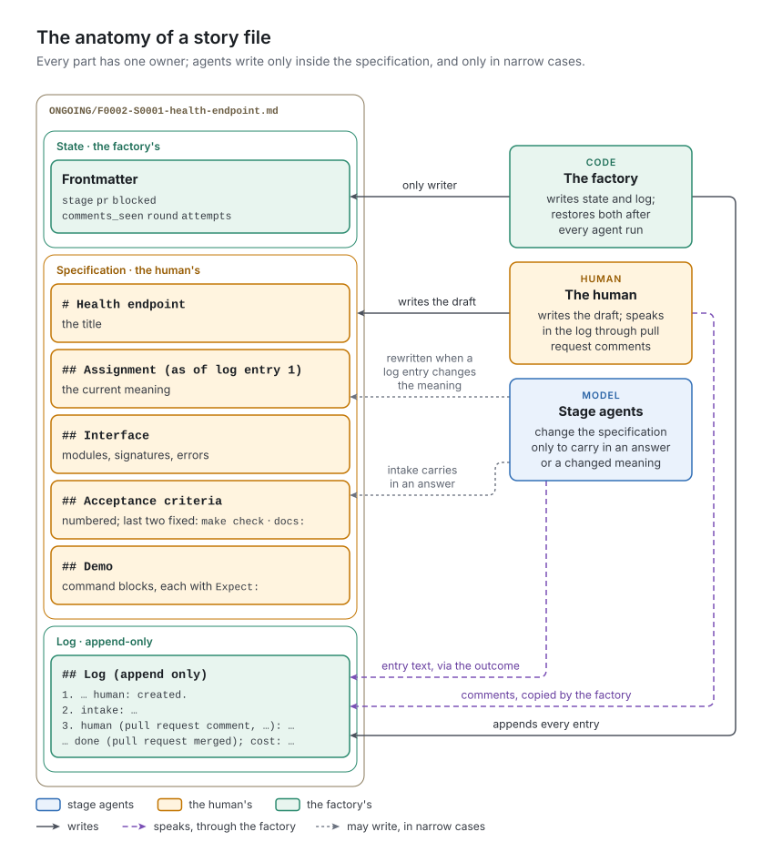

# 4. Work items

[Chapter 2](../02-concepts/README.md) introduced the story as one document with three jobs: specification, state and memory. This chapter specifies that document as v1 implements it. [Chapter 11](../11-feature-acceptance/README.md) covers the other kind of work item, the acceptance report.

## The concept

A work item is read by people, by models and by code, and each needs something different. The human needs prose they can write on a phone. A model needs sections it can find and quote. Code needs a few fields it can parse without judgment. A good form gives each reader its own part, and gives every part one writer:

- *The specification* is the human's. A role may change it only to carry in something the human decided, and its log entry says so.
- *The state* is the factory's. No agent writes it; whatever an agent does to it is undone (P10).
- *The log* has one writer from promotion on, the factory, and everyone speaks in it: the factory appends each entry under the next number, starting with who speaks, so that the next stage, and code, can find the last word of a given role.

The path shows the lifecycle and the identifier gives identity and order ([chapter 2](../02-concepts/README.md)); both must survive every move the factory makes. The form's rules that have one right answer are validated by code before every agent run and after it.

## In v1

### Where work items live

| Path | What it is | Who puts it there |
| :- | :- | :- |
| `factory/features/` | the root of all work (`root:` in `stages.yml`) | the human |
| `<root>/F0002-operations/` | a feature folder | the human |
| `…/FEATURE.md` | the feature: goal, scope, out of scope, stories | the human |
| `…/drafts/F0002-S0004-….md` | a draft story | the human; the factory, on a discard; the acceptor proposes drafts on its branch, which land only with the human's merge |
| `…/ongoing/F0002-S0001-health-endpoint.md` | a story in production | the human, by `git mv` from `drafts/` and a push |
| `…/done/F0002-S0001-health-endpoint.md` | an archived story | the factory, in the commit that sets `stage: done` |
| `…/ACCEPTANCE.md` | the feature's acceptance report, a work item of its own | the factory writes its head, the acceptor its body ([chapter 11](../11-feature-acceptance/README.md)) |

A story is a file exactly three levels below the root with `ongoing` in the middle (`watch._is_live`); a file deeper or beside is not a story. Git has no empty folders, so a feature whose stories are all archived simply has no `drafts/` and no `ongoing/`. The acceptance's due rule counts *any* file there, so a placeholder such as `.gitkeep` keeps a feature incomplete forever. The templates the human copies from live beside the stage table: `factory/TICKET.md` for a story, `factory/FEATURE.md` for a feature.

### Identifiers

| Identifier | Pattern (`watch.py`) | Example |
| :- | :- | :- |
| Feature folder | `FEATURE_PATTERN`: `^(F\d{4})(?:-[a-z0-9]+)*$` | `F0002-operations` |
| Story file stem | `ID_PATTERN`: `^(F\d{4}-S\d{4})(?:-[a-z0-9]+)*$` | `F0002-S0001-health-endpoint` |
| Story id | the first group of `ID_PATTERN` | `F0002-S0001` |
| Acceptance id | the feature folder's whole name | `F0002-operations` |
| Story branch | `ticket/<file stem>` | `ticket/F0002-S0001-health-endpoint` |
| Acceptance branch | `acceptance/<feature folder>` | `acceptance/F0002-operations` |
| Commit subject prefix | `ticket <id>:` or `acceptance <feature folder>:` (`ops.subject`) | `ticket F0002-S0001: tests → doing` |

Slugs are lowercase letters, digits and hyphens. A file whose stem does not match keeps its whole stem as its id. Ids must be unique: two work items with one id stop the repository (the `duplicate` event, [chapter 6](../06-watcher/README.md)). Order is a plain string sort of the ids (`scan_tickets`), so an acceptance sorts after its feature's stories only because a lowercase slug sorts after `S`. A feature folder with a slug that starts with a digit (`F0002-2fa`), or with no slug at all, sorts its acceptance before its stories.

Not everything is keyed by the id. The branch carries the whole file stem, and the cost records carry the path the story had in `ongoing/` ([chapter 14](../14-runtime/README.md)).

### The story form

`template/TICKET.md` is the template every story copies. Its `## ` headings are the required sections. Code reads them from the project's own copy, so a project that adds a section to its template makes that section required.

*Figure 4-1. The anatomy of a story file: the factory's state at the top, the human's specification in the middle, the log at the bottom, and who may write each part.*

| Section | Contents | Written by | Read by |
| :- | :- | :- | :- |
| `# <Title>` | the story's name | the human | the pull request's title |
| `## Assignment (as of log entry N)` | what is to be built and why: the story's *current* meaning | the human; rewritten by a stage when a log entry changes the meaning, with the heading's entry number updated | every stage; the pull request's description |
| `## Interface` | module paths, names, signatures, error types; every behavior a comment states needs a criterion | the human; intake carries in an answer | the tester (tests are written against it), the coder, the reviewer |
| `## Acceptance criteria` | numbered, one behavior each, failing sides included; the last two are fixed (see *Form validation*) | the human; intake carries in an answer, before the two closing criteria | every stage; the pull request's description |
| `## Demo` | commands, each block followed by a line `Expect: …` | the human; intake carries in a changed expectation | the demo stage, which writes the output into its own entry |
| `## Log (append only)` | the numbered log | the human's first entry; the factory after that | every stage; code (see the first limit below) |

A draft needs no frontmatter. Its first log entry is the human's own: `1. 2026-10-05 human: created.`

The template's own text about the Demo is stale. It says the demo stage pastes the output below each command; the `stage-demo` skill puts it into the stage's log entry instead, and leaves `## Demo` to the human.

### The feature form

`template/FEATURE.md` has a title and four sections: `## Goal`, `## Scope`, `## Out of scope` and `## Stories`, a list in story order. The demonstration project's features add a fifth, `## Decisions taken for the human`, which intake and the acceptor cite. Code reads only the title, for the acceptance report's heading `# Acceptance of <title>` (`stage._open`), and requires the file beside every story. The guard refuses every agent's write to any file named `FEATURE.md` (`guard.NEVER_NAMES`): that is how the human's ownership is enforced.

### The state fields

A story in production carries YAML frontmatter, written only by the factory, in a fixed key order (`story.FIELDS`, then `story.TRAILING` for the acceptance report, then anything else in its own order):

| Field | Values | Set by | Read by |
| :- | :- | :- | :- |
| `stage` | a key of `stages:` | `stage._open` (the first stage), `stage._move`, `dispatch.merged`, `_refused`, `_sent_back`, `reject` | the watcher; every handler |
| `pr` | the pull request's number, or `null` | `stage._ensure_pull_request` | the watcher (which pull requests to poll) |
| `blocked` | `null`, `question` (recorded) or `asked` (posted) | `stage._ask` sets `question`; `dispatch.ask` and `_sent_back` set `asked`; `answers`, `stage._move` and `merged` clear it | the watcher |
| `comments_seen` | the number of comments on the pull request the factory has taken in | every handler that reads or posts | the tick (`needs_handling`) |
| `round` | a count, from 0 | `stage._rework`, `dispatch._sent_back` | the stage protocol (the cap); the task |
| `attempts` | a count, from 0 | `ops.stall`, `dispatch.expired`; reset by `answers` at the cap | the watcher (the cap) |
| `stories` | the archived story ids an acceptance covers | `stage._open` | the watcher (whether an acceptance is due) |
| `outcome` | `accepted` or `refused` | `dispatch.merged`, `_refused` | the board |

A story with no frontmatter is at `ready` (`watch.Ticket.stage`). When the first stage opens the branch, `stage._open` writes all six fields with their defaults, and any key the human already put in the draft wins over the default. Values are written in YAML's flow style: `blocked: null`, `stories: [F0002-S0001, F0002-S0002]`.

Every frontmatter write renders through `story.render`. The handlers write through `ops.edit`, which sets fields and appends entries in one read-modify-write of the file in the working tree, and drops `claimed_at`, the field in which the watcher's contract, version 4, kept the run record before it moved to `.git/factory-run.json`. `dispatch._refused` drops it too.

### The log

The log is the list under the first heading that starts with `## Log`. Entries are numbered from 1 without gaps. The factory appends the number after the last entry (`story.append`), whatever numbered lists appear earlier in the story. A multi-line entry keeps its continuation lines inside the list item by indenting them by the width of its marker: three spaces after `9. `, four after `10. `. A blank line inside an entry stays blank. Because every continuation line is indented, a `## ` line inside an agent's entry, from pasted output for instance, can never end the log.

Each entry starts with who speaks. The factory writes these prefixes:

| Entry starts with | Written when | Written by |
| :- | :- | :- |
| `<agent>: ` (`intake: `, `tester: `, …) | an agent's decision is kept; or it is held because a check is red or the form broke | `stage._apply`; an agent's own leading name or stage name (`coder:`, `doing:`, any case) is removed first (`_unprefixed`) |
| `human (pull request comment, <date>): ` | a human comment is copied from the pull request | `dispatch._copy_comments` |
| `stage <stage> stalled: <reason>; partial work committed` | any stall | `ops.stall` |
| `run expired: the run that held it ended without finishing (lease over or machine restarted)` | an agent run died | `dispatch.expired` |
| `illegal stage change <a> → <b>, moved back` | a stage change the table does not allow | `dispatch.reject` |
| `Stage <stage> stalled <n> times. The last time: …` | the attempts cap is reached | `dispatch.ask` |
| `The pull request was closed without a comment. What should happen? …` | the human closed at the gate without a reason | `dispatch._sent_back` |
| `This story has now been sent back <n> times, more than <cap>. What should happen? …` | the human closed at the gate past the round cap | `dispatch._sent_back` |
| `done (pull request merged); cost: …` | the human merged | `dispatch.merged` |
| `done (pull request closed by the human); cost: …` | the human refused an acceptance | `dispatch._refused` |

Inside an agent's entry the factory appends what it observed. One paragraph holds the last line of each check and report, one per line (`` `make lint`: lint: green ``). Separate paragraphs hold the form's findings when a forward decision met them, the paths the factory undid outside the lane, and at the round cap the cap question. The cost line has a fixed shape, from `costs.one_line`: `cost: 7 runs, 2.8 min, 40 turns, 157k tokens in (567k more from cache), 13k out, $1.36`.

Only the human's entries carry a date; Git has the time of every commit.

`src/factory/story.py` holds every function that edits a story, and knows the format and nothing else: no Git, no model. Besides `split`, `render` and `append`, two functions matter: `with_log(body, source)` puts the log of one version into another, which is how the factory restores its log after an agent run, and `insert_under(body, heading, line)` puts a paragraph first under a heading, used once, for the human's refusal under an acceptance's `## Verdict`.

### Form validation

`story.check` and `story.check_place` return one sentence per problem:

| Rule | Function |
| :- | :- |
| The file name matches `ID_PATTERN`, and its feature id matches the folder | `check_place` |
| `FEATURE.md` exists in the feature folder | `check_place` |
| Some line of the body starts with `# ` | `check` |
| Every `## ` section of the project's `factory/TICKET.md` is present (its parenthesized note ignored); order and duplicates are not checked | `check`, `required_sections` |
| The criteria are numbered 1 to *n* (an empty list passes) | `_criteria` |
| With two criteria or more: the second-to-last contains `make check` and `green`, the last starts with `docs:` | `_criteria` |
| `## Demo` has at least one fenced block, and the first non-blank line after each block starts with `Expect:` | `_demo` |
| The log's entries are numbered 1 to *n* | `check` |

The stage protocol validates a story's form, never an acceptance's, before and after every agent run; what it does with the findings is in [chapter 5](../05-stage-machine/README.md) (rule 1 of the decision) and [chapter 8](../08-stage-run/README.md).

`factory-check-story <path>…` prints the same findings and exits 1 when there are any. Nothing in the loop calls it: it is the human's tool, for a draft before promotion.

> [!WARNING]
> **v1 limit:** log text is parsed back as data. Four places read entries by their prefix or their wording:
> - `dispatch._reason_given` treats a human comment after the last entry starting with `demo` as the reason for a send-back;
> - `stage._task` recognizes an approved test change by a last entry starting with `coder:`;
> - `stage._story_body` fills the pull request's description from the last entries of `tester`, `reviewer`, `documenter` and `demo`;
> - `stage._acceptor_facts` sums the archived stories' cost with the regular expression `stage.COST` over the `done` entry.
>
> A renamed role, or a change to `costs.one_line`, breaks these silently: the description shows `none` and the cost sum shows $0.00.

> [!WARNING]
> **v1 limit:** the identifier format is fixed in code: `F` and four digits, `S` and four digits, lowercase slugs, plain string order. A project cannot choose another scheme, and nothing but the human's numbering expresses priority.

> [!WARNING]
> **v1 limit:** a story's slug is part of its identity in two places, its branch and its cost records. Renaming a story's file while it is in production leaves its branch, its state and its costs under the old name.

> [!WARNING]
> **v1 limit:** headings are found by `# ` and `## ` at the start of a line, with no regard for code fences. A comment line `## start the server` inside a `## Demo` block ends the section there, so validation reports the block as missing or without `Expect:`; a `# comment` in any code block satisfies the title rule. The acceptance reports of the demonstration project already contain such lines in pasted scripts; they do no harm only because none of them starts with a section name code looks for.

> [!WARNING]
> **v1 limit:** a draft's own frontmatter wins. `stage._open` writes the defaults under any key the human put in the draft, and a story promoted with `stage: tests` is never opened at all: the checkout of its missing branch raises, the tick retries three times and gives up, and with no pull request yet, only the factory's log file says so.

> [!WARNING]
> **v1 limit:** the feature form is not validated. A `FEATURE.md` without a goal or an out-of-scope section passes; only its existence and its title are used.

> [!IMPORTANT]
> **Planner:** what this chapter fixes.
> - **Essential:**
>   - one versioned document per work item, in three parts with one writer each: specification (the human), state (the factory), log (append-only, written by the factory from promotion on);
>   - every log entry numbered, attributed to its speaker by a fixed prefix, and appended only by the factory;
>   - the lifecycle shown by location, the state in fields only the factory writes;
>   - unique identifiers that sort;
>   - the form's rules with one right answer validated by code before every agent run and after it; a new finding after an agent run is a stall.
> - **Incidental to v1:** Markdown with YAML frontmatter; the folder names; the id pattern; the section names (validation reads them from the project's template); the prefix strings.
> - **Watch for:**
>   - code must not re-derive state from prose. v1's four parsers of log text (above) are the counterexample: keep the speaker, the kind of entry and the cost as structured data beside the text;
>   - test: renaming a story's slug in production keeps its branch, state and cost;
>   - test: a draft's own frontmatter (`stage: tests`, `attempts: 0` on a story that stalled before) cannot skip intake or the caps;
>   - test: an acceptance sorts after its feature's stories whatever the slug;
>   - the section parser must respect code fences;
>   - a discard must restore the human's text byte for byte.
