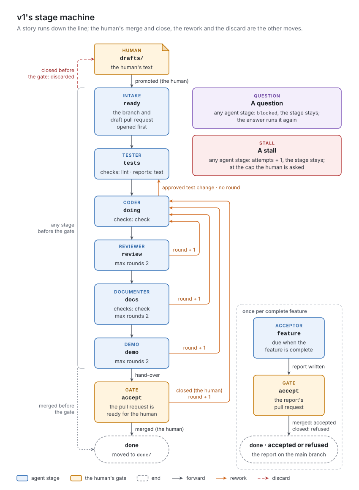

# 5. The stage machine

[Chapter 2](../02-concepts/README.md) introduced the stage table as the factory's program, and the four ways a story does not move forward. This chapter makes both exact: the table's schema, then every transition a work item can take, with its trigger and its effect on the counters.

## The concept

The machine's state is a work item's stage plus three fields that change how the stage is treated: whether a question is open (`blocked`), how many rounds of rework it has used, and how many times it has stalled. The pull request's number and the count of comments read are bookkeeping for the channel to the human; no transition depends on them.

Every move has one of four causes:
- *the human's promotion*, which starts the work item;
- *an agent's decision*, applied by the factory through the stage protocol: forward, back, `question` or `stuck`;
- *the factory's own observation*: a dead agent run, a red check, a broken form, a cap reached, a stage change nobody was allowed to make, a feature that has become complete;
- *the human's action* on the pull request: merge, close, comment.

Ownership decides where each rule lives. The stages, their order, their checks and caps belong to the project, so they are configuration. What a merge or a close *means* is the same in every project, so it is code: a merge is acceptance, a close says the human does not want this version. *Where* a close at the gate sends the work and which cap it counts against are project decisions, and belong in the table. A table-driven machine is only as configurable as the code that never names a stage; the end of this chapter applies that test to v1.

## In v1

### The stage table, key by key

`factory/stages.yml` holds these keys:

| Key | Meaning | Read by | Missing |
| :- | :- | :- | :- |
| `version` | the watcher's contract version, 5 | nothing: it documents which `docs/WATCH_CONTRACT.md` the table was written against | no effect |
| `root` | where the feature folders are | the watcher; the lane undo | `factory/features` |
| `lease_minutes` | the run record's lease; also the wall-clock limit of an agent run and of each `make` call | the watcher (`busy`, `expired`), the tick (lock, timeouts) | a `KeyError`: every tick fails |
| `max_attempts` | stalls per work item before the human is asked | the watcher (`_runnable`), the handlers | 2 |
| `lanes.<agent>` | glob patterns over repository paths the agent may write; `*` also crosses `/` | the guard hook, the lane undo | the agent may write nothing |
| `stages.<key>.agent` | the agent file that plays the stage, or `null` | the watcher, `dispatch.run`, the preflight | `null`: the stage never runs |
| `stages.<key>.gate` | marks the human's stage (v1 writes `human`) | the watcher, for any non-null value (which pull requests to poll); `stage._move`, for a truthy value (the hand-over) | not a gate |
| `stages.<key>.next` | the allowed decisions; the first is forward | `stage._allowed`, `_decide`, `watch._rejected` | only `question` and `stuck` are allowed; an explicit `next: null` crashes `_rejected` |
| `stages.<key>.checks` | `make` targets that must exit 0 before a forward move is kept, run in order, stopping at the first red | `stage._checks` | none |
| `stages.<key>.records` | `make` targets run after all checks are green, before the forward move is committed; each one's last line is noted, red or green (the book's *reports*) | `stage._checks` | none |
| `stages.<key>.max_rounds` | the cap on the story's round counter when this stage sends it back | `stage._decide`, `_rework`; `dispatch._sent_back` (`demo`'s only) | no round is counted for this stage's moves back; for `demo`, the human's send-backs are still capped at 2 (`ops.max_rounds`) |

v1's table, as shipped in `template/stages.yml` and used unchanged by the demonstration project:

| Stage | `agent` | `next` | `checks` | `records` | `max_rounds` |
| :- | :- | :- | :- | :- | :- |
| `ready` | intake | `tests` | | | |
| `tests` | tester | `doing` | `lint` | `test` | |
| `doing` | coder | `review`, `tests` | `check` | | |
| `review` | reviewer | `docs`, `doing` | | | 2 |
| `docs` | documenter | `demo`, `doing` | `check` | | 2 |
| `demo` | demo | `accept`, `doing` | | | 2 |
| `accept` | `null`, `gate: human` | `done`, `doing` | | | |
| `feature` | acceptor | `accept` | | | |
| `done` | `null` | (none) | | | |

with `lease_minutes: 60` and `max_attempts: 2`. The lanes are listed in [chapter 8](../08-stage-run/README.md). The decisions `question` and `stuck` are always allowed besides `next` (`stage.EXTRA_OUTCOMES`), so a stage key with either name would collide with them.

### Transitions

The three tables below list every move, grouped by cause. *Any agent stage* means a stage whose `agent` is set; *the event* and *the handler* point to [chapter 6](../06-watcher/README.md), [chapter 7](../07-dispatcher/README.md) and [chapter 8](../08-stage-run/README.md).

*An agent's decision.* After an agent run, `stage._decide` takes the first matching rule, in this order:

| Rule | Condition | To | Counters and flags |
| :- | :- | :- | :- |
| 1 | a forward decision, and form validation had findings before the agent run | unchanged | `blocked: question`, the findings appended to the entry |
| 2 | `question` | unchanged | `blocked: question` |
| 3 | another entry of `next`, the stage has `max_rounds`, `round` + 1 within it | that stage | `round` + 1; no checks run |
| 4 | the same, `round` + 1 above the cap | unchanged | `round` + 1; `blocked: question` with the cap question |
| 5 | a forward decision, a check red | unchanged | `attempts` + 1: a stall; later checks and all reports skipped |
| 6 | a forward decision, all checks green | `next[0]` | `blocked` cleared; reports noted; at a gate, the hand-over |
| 7 | another entry of `next`, the stage has no `max_rounds` (v1: `doing → tests`) | that stage | none: no round, no checks |

Before `_decide`, any result the factory cannot keep is a stall, `attempts` + 1, with the stage unchanged: `stuck`, an error, no decision, a decision the table does not allow, a form that broke during the agent run. Rule 1 applies at every stage, but only intake's task names the findings; an agent at a later stage is not told why its forward move became a question. After the round cap (rule 4), answering the question runs the *sending* stage again, and every further send-back from an agent asks again, because the counter keeps climbing.

*The factory's observation.*

| From | Trigger | To | Counters and flags | Event · handler |
| :- | :- | :- | :- | :- |
| `ready`, no branch | intake is due | `ready` on a new branch | the six fields written with defaults; draft pull request opened | `run` · `stage._open` |
| no report, or a booked report covering fewer stories | a feature became complete | `feature` on a new branch | the report's head written, with `stories` | `run` · `stage._open` |
| any branch stage | the branch cannot fast-forward, or the main branch does not merge into it | unchanged | `attempts` + 1: a stall | `run` · `stage._prepare` |
| any agent stage | the agent left its branch | unchanged | none: a failure of the factory, retried | `run` · `stage.run` raises |
| any agent stage | the run record outlived its lease, or the machine restarted | unchanged | `attempts` + 1; the run record cleared | `expired` · `dispatch.expired` |
| any agent stage | `attempts` ≥ `max_attempts` | unchanged | `blocked: asked`; the attempts-cap question posted | `ask` · `dispatch.ask` |
| any stage | `blocked: question` | unchanged | `blocked: asked`; the last entry posted as the question | `ask` · `dispatch.ask` |
| any | the last commit changed a stage to one `next` does not list | the previous stage | an entry and a note; the commit says `moved back` | `reject` · `dispatch.reject` |

A stall commits the partial work as it is (`ops.stall`), so the next attempt continues from it. A *branch stage* is any stage after `ready`'s first agent run: the work item has its own branch.

*The human's action.*

| From | Trigger | To | Counters and flags | Event · handler |
| :- | :- | :- | :- | :- |
| draft | moved to `ongoing/` and pushed | `ready` (implicit: no frontmatter yet) | none | none: the human's commit |
| any stage, `blocked: asked` | a new human comment | unchanged; the stage runs again | `blocked` cleared; at the attempts cap, `attempts` = 0 | `pr` · `dispatch.answers` |
| `accept` | a new human comment | unchanged | the comment copied into the log; it becomes the reason if the human then closes | `pr` · `dispatch.answers` |
| `accept` (a story) | closed with a reason, `round` + 1 within `demo`'s cap | `doing` | `round` + 1; the pull request reopened as a draft | `closed` · `_sent_back` |
| `accept` (a story) | closed without a reason, or past `demo`'s cap | `doing` | `round` + 1; `blocked: asked` with the send-back question | `closed` · `_sent_back` |
| any other stage (a story) | closed | back to `drafts/` on the main branch | the branch deleted | `closed` · `_discard` |
| any stage (an acceptance) | closed | `done` on the main branch | `outcome: refused`; the drafts dropped | `closed` · `_refused` |
| any stage (a story) | merged | `done`, archived to `done/` | `blocked` cleared; the branch deleted | `merged` · `dispatch.merged` |
| `accept` (an acceptance) | merged | `done` | `outcome: accepted` | `merged` · `dispatch.merged` |

A reason is a human comment copied into the log after the demo stage's last entry, including one written together with the close. The factory sees a close or a merge while the human is expected to act, at a gate or with a question posted, and otherwise only before that work item's next agent run (`dispatch.run`). A story merged before its gate is therefore archived at whatever stage it had reached; the human accepted it as it was. The booking commit's subject still reads `accept → done`.

A work item whose `stage` is not a key of the table is neither run, nor polled, nor rejected: it sits.

### The counters

| Counter | Counts | Compared with | Reset |
| :- | :- | :- | :- |
| `round` | each move back from a stage that has `max_rounds`, and each close at `accept` | the sending stage's `max_rounds`; a close at `accept` with `demo`'s | never |
| `attempts` | each stall and each expired agent run, at any stage | `max_attempts` | only by the human's answer to the attempts-cap question |
| failures | a handler that raised or failed, per event and repository state | `MAX_FAILURES = 3`, in `tick.py` | when the event or the checkout's `HEAD` changes |

Both story counters run across stages. Two review reworks and one documentation rework make three rounds, which exceeds the documentation stage's cap of 2, so the third send-back becomes a question. Attempts accumulate the same way: a red lint at `tests` and a dead agent run at `docs` together reach the cap of 2.

### Order between work items

The watcher always picks the lowest identifier in a stage with an agent ([chapter 6](../06-watcher/README.md)). A story's stages are therefore not run back to back. If the human promotes `F0001-S0003` while `F0001-S0004` is at `docs`, the next tick runs intake on S0003, and S0004 resumes only when S0003 has left production. Two stories are in production at once; the later one merges the main branch before its next stage, and if the two touched the same lines, that merge conflicts and its stage stalls.

*Figure 5-1. v1's stage machine: the forward path from intake to the human's gate, the moves back to the coder, the human's merge and close, and the acceptance's own short path.*

### Names in the code

The table is meant to be the whole program. These places name a stage, a role or a folder themselves, so a project that renames or removes it breaks:

| Name | Where | What depends on it |
| :- | :- | :- |
| `ready` | `watch.py:49` (`MAIN_STAGES`), `:80`, `:292–293`; `ops.py:129`; `stage.py:146`, `:192` | the default stage of a story without frontmatter; intake starts on the main branch; intake after an answer; the form's findings in the task |
| `feature` | `watch.py:48` (`FEATURE_STAGE`) | the stage a due acceptance starts in, on the main branch |
| `done` | `watch.py:221`, `:243`, `:454`; `stage.py:77`, `:160`; `dispatch.py:40–43`, `:72` | the archive folder; the stage a merge or refusal writes; when an acceptance is booked |
| `accept` | `dispatch.py:55` | a close here sends back; anywhere else it discards |
| `doing` | `dispatch.py:117` | where a send-back from the gate goes |
| `demo` | `dispatch.py:103`, `:118` | whose entry marks the hand-over (for the reason); whose `max_rounds` caps the human's send-backs |
| `tests`, `coder:` | `stage.py:188` | the approved test change is recognized by a last entry of the coder at `tests` |
| `tester`, `reviewer`, `documenter`, `demo` | `stage.py:429–432` | the sections of the pull request's description at the gate |
| `drafts`, `ongoing`, `done` | `watch.py:46` (`LIVE`), `:249`, `:473`; `stage.py:419–420`; `dispatch.py:43`, `:139` | the lifecycle folders |
| `question`, `stuck` | `stage.py:47` | the decisions every stage may take |
| every stage key | `claude/skills/stage-*/SKILL.md`; the `skills:` list of each agent file | each agent preloads one stage skill, which names its decisions (`stage-review`: "end with `docs` … `doing`") |

The `gate` key is the one part of the human's side the table controls: any stage marked with it is polled and handed over.

> [!WARNING]
> **v1 limit:** the stage table is less configurable than it looks. A project can change checks, reports, caps and lanes freely. It cannot add a role: agents and their skills are installed in the image, the preflight requires every agent the table names, and each stage skill names its stage's decisions. Renaming `ready`, `accept`, `doing`, `demo` or `done`, or moving the gate, breaks the code paths in the table above. Dropping `demo` raises no error but changes behavior silently: with no demo entry in the log, any human comment counts as the reason for a send-back.

> [!WARNING]
> **v1 limit:** `stages.yml` is parsed as plain YAML with no schema, and the `version` field is never read. A missing `lease_minutes` makes every tick fail. A `next` that names no stage, or an agent without a lane, is found only when it is reached. The factory's own commits also depend on the table: its booking commit of an accepted acceptance needs `done` in `accept`'s `next`, and its send-back needs `doing` there, or the next evaluation's `reject` undoes them.

> [!WARNING]
> **v1 limit:** an acceptance merged before its gate loops. If the human merges an acceptance's pull request while it waits with a question at `feature`, `dispatch.merged` writes `stage: done` on the main branch, which `feature`'s `next` does not allow. By the code, `reject` sets it back to `feature`, the pull request is still merged and still polled, and the two handlers alternate on every tick. A story is safe, because its archive moves the file, and `reject` ignores moved files.

> [!WARNING]
> **v1 limit:** the comment on `max_attempts` in `template/stages.yml` says it counts "stage runs that ended without a commit". That was contract version 4. In v1 it counts every stall and every expired agent run (`ops.stall`, `dispatch.expired`), whether anything was committed or not.

> [!WARNING]
> **v1 limit:** `doing → tests` costs no round only because `doing` has no `max_rounds`. Adding one, to cap the coder's own moves back, would also count the approved test change as rework.

> [!IMPORTANT]
> **Planner:** what this chapter fixes.
> - **Essential:**
>   - the machine's state is the stage plus `blocked`, `round` and `attempts`;
>   - every transition has one of four causes: the human's promotion, an agent's decision, the factory's observation, the human's action on the pull request. The three tables under *Transitions* are the reference; each row is a test case;
>   - the order inside the decision rule (`_decide`): form findings turn a forward decision into a question; a question blocks; a capped move back counts a round or asks; checks run only for a forward move, in order, stopping at the first red; reports run only after all checks are green;
>   - any result the factory cannot keep costs an attempt, commits the partial work, and leaves the stage unchanged; a fault of the factory itself (the agent left its branch) is a failure, not an attempt;
>   - a story's merge archives it at any stage; a close discards before the gate and sends back at the gate; an acceptance's close refuses it.
> - **Incidental to v1:** the stage names; the caps of 2; `make` as the check runner; YAML.
> - **Watch for:**
>   - every behavior v1 hard-codes by name (*Names in the code*) needs a key in the table: where a close at the gate sends back, which cap the human's send-back uses, which stages start on the main branch, which roles fill the pull request's description, which stage is terminal;
>   - validate the table at load time, against the installed agents and skills, and check `version` against the code's contract;
>   - the factory's own moves must be legal under the table, or exempt from the illegal-change check by construction, not by luck (the acceptance loop above);
>   - tell the agent why its forward move became a question;
>   - decide whether a rework round and an approved change of direction are the same counter;
>   - decide whether another story may start between two stages of a story. v1 allows it, so a merge of the main branch can conflict.
