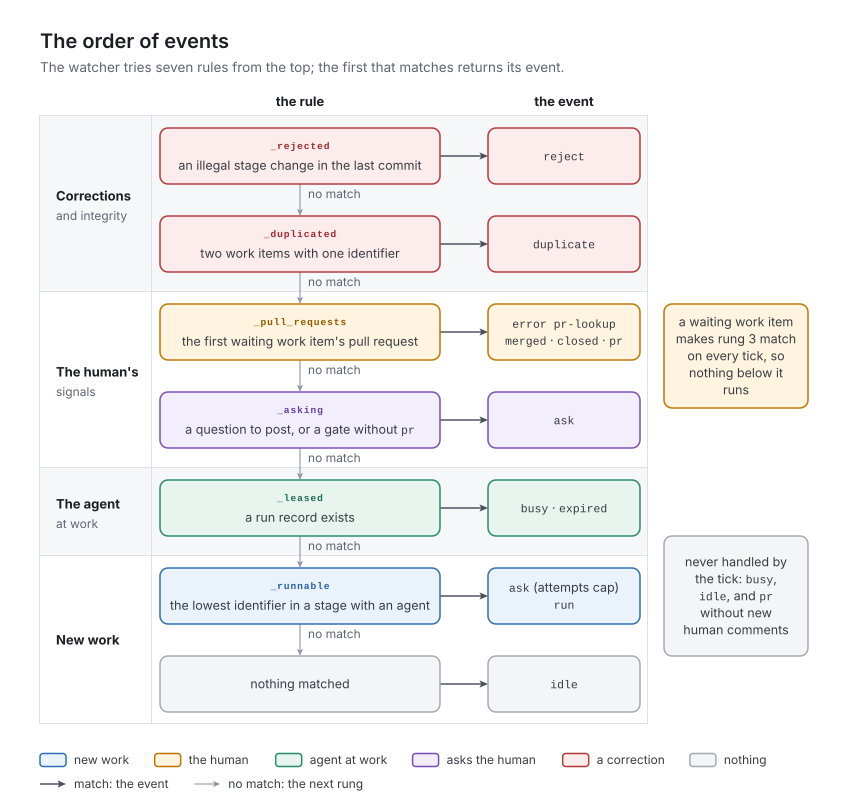

# 6. The watcher

The watcher answers one question on every tick: what is the one next thing to do? This chapter specifies its inputs, the order of its rules, each reader, and what it costs.

## The concept

The watcher is split in two so that the hard part can be tested without the world. *Readers* turn the repository and the hosting service into a snapshot: the stage table, every work item's state fields, the last commit's stage changes, the run record, and the state of the pull requests the human is expected to act on. *The evaluation* is a function from that snapshot and the current time to one event, tested with hand-written snapshots. It keeps no memory, so a restarted machine evaluates exactly as before.

The order of the rules is a contract, not an implementation detail. It encodes four tiers, from the top:

1. *Corrections and integrity:* a state the factory must not build on, such as an illegal stage change or two work items with one identifier, stops everything else.
2. *The human's signals:* a merge, a close, an answer, or a question still to be posted comes before any other work. A work item that waits for the human holds back all new work in its project (P3, P5).
3. *The agent at work:* while an agent run is in progress, or has died, nothing new starts.
4. *New work*, in identifier order, the only priority (P5).

Readers decide what the watcher can see, and so what the factory notices. Reading a source has a price (a command, a network call, a rate limit), so a reader reads only what an event could come from: P13 applied to observation.

## In v1

`src/factory/watch.py` implements the readers and `evaluate()`. Its specification is `docs/WATCH_CONTRACT.md`, version 5, which v1's documents call the watcher's contract; where the two differ, this chapter says so. `tests/test_watch.py` tests the order with hand-built snapshots, and the readers against throwaway Git repositories.

`evaluate()` is pure except in one place: the pull requests are not read in advance. The evaluation receives a lookup function and calls it, running `gh`, only for the first work item that waits. That laziness is what keeps an evaluation to at most one lookup.

### The rules, in order

A work item **waits** when it has a `pr` and is either at a gate or has `blocked: asked`. `evaluate()` returns the first match of seven rules:

| Tier | Event (v1's line) | Condition | Rule |
| :- | :- | :- | :- |
| 1 | `reject <path> <from> <to>` | the checkout's last commit changed a work item's stage to one `<from>.next` does not list | `_rejected` |
| 1 | `duplicate <id> <path> <path>` | two work items with the same identifier | `_duplicated` |
| 2 | `error pr-lookup <path>` | the first waiting work item's pull request could not be read | `_pull_requests` |
| 2 | `merged <path> <branch>` | it is merged | `_pull_requests` |
| 2 | `closed <path> <branch>` | it is closed without a merge | `_pull_requests` |
| 2 | `pr <path> OPEN <n>` | it is open, with *n* comments | `_pull_requests` |
| 2 | `ask <path>` | the first work item with `blocked: question`, or at a gate without a `pr` | `_asking` |
| 3 | `busy <path>` | a run record exists and is younger than `lease_minutes` | `_leased` |
| 3 | `expired <path>` | a run record exists and is as old as `lease_minutes` or older | `_leased` |
| 4 | `ask <path>` | the first work item in a stage with an agent has `attempts` ≥ `max_attempts` | `_runnable` |
| 4 | `run <agent> <path> <where>` | otherwise that work item's stage is due; `<where>` is `main` for `ready` and `feature`, else its branch | `_runnable` |
| 4 | `idle` | nothing else | |



*Figure 6-1. The order of events: corrections first, then the human's signals, then the agent at work, then new work; the first match is the event.*

While a work item waits, the `pr` event comes out on every evaluation, with or without new comments; the tick decides whether it needs handling ([chapter 7](../07-dispatcher/README.md)). That is how waiting holds back all new work in code: nothing below the second tier is ever reached. `busy` blocks new work for a different reason, the one-agent-run rule, and the tick never handles it.

The watcher's contract lists the attempts cap with the other `ask`. The code tests it in `_runnable`, after the run record and only for the first work item that has an agent, so a capped work item with a higher identifier is asked about only when no lower one can run.

### Reading the work items

`scan_tickets` finds the work items and reads each one's state:

- *Which stories exist:* the files at `<root>/*/ongoing/*.md` in `origin/main`, listed with `git ls-tree`, or in the working tree when there is no `origin/main`. A story is in production exactly when the main branch has it in `ongoing/`.
- *Where each story's state comes from:* the tip of its branch `ticket/<stem>`, the local branch first, then `origin/`; without a branch, `origin/main`; without that, the working tree. A fetch moves only the `origin/` refs, so a hand push to a story's branch stays invisible while a stale local branch exists, until the factory next checks that branch out and fast-forwards it.
- *Merged branches count as absent.* A branch that is an ancestor of `origin/main` (`merged_into_main`) is skipped, however long its ref lingers: after the human's merge, the main branch has the newer copy. HEAD is not the yardstick, because between stages the checkout sits on the story's branch.
- *The order* is a plain string sort of the identifiers ([chapter 4](../04-work-items/README.md)).

An acceptance is not listed anywhere; `acceptance_ticket` derives it per feature folder from all the folder's files:

| Situation | Result |
| :- | :- |
| the branch `acceptance/<feature>` exists and has the report | the report, read from the branch: in flight |
| the main branch has a report whose `stage` is not `done` | the report as it is: merged but not yet recorded as `done`, so the `merged` event can still come |
| the feature has no archived story, or any file at all in `ongoing/` or `drafts/` (a `.gitkeep` included) | nothing: incomplete |
| the main branch has a report at `done` whose `stories` equal the archived ids | nothing: the status stands until another story is archived |
| otherwise | a work item at stage `feature`, whether no report exists or an old one covers fewer stories: due |

The second row exists because a merged acceptance brings its proposed drafts to the main branch, which makes the feature look incomplete before the factory has recorded the merge.

### Reading the last change

`last_change` reads the checkout's last commit (`git diff --name-only HEAD~1 HEAD -- <root>`, so every file under the root counts, not only work items) and returns the first file whose `stage` differs between the two commits; a file without frontmatter counts as `ready`. It returns nothing when:
- the commit is a merge (`HEAD^2` exists), because a merge brings stage changes that were legal where they happened;
- the subject contains `moved back`, which is how the factory marks its own correction;
- the file was added or deleted in the commit, as with a promotion, an archive or a discard;
- the repository has fewer than two commits.

`_rejected` then compares the new stage with the old stage's `next`; a stage missing from the table has an empty `next`, so any change away from it is rejected. The factory restores the state fields after every agent run before it commits ([chapter 8](../08-stage-run/README.md)), so `reject` mostly catches a stage changed by hand; the one exception is in the limits below.

### Reading the pull requests

`gh_pr_state` runs `gh pr view <pr> --json state,comments` and returns the state (`OPEN`, `MERGED` or `CLOSED`) and the number of comments, or nothing when `gh` fails. `_pull_requests` calls it only for work items that wait, in identifier order, and returns on the first. A work item's merge or close while the stages work is therefore not seen here; the dispatcher reads the pull request once before every agent run instead ([chapter 7](../07-dispatcher/README.md)). Handlers make further lookups. Per tick, an idle evaluation makes at most one; a handled `pr` event makes up to four (the evaluation, the test for the factory's own comments, and two in `answers`); a `run` makes one before the agent, plus one after each post, to count the comments.

With v1's own moves, only one work item can wait at a time. A work item starts waiting only through its own agent run (a move to a gate), through `dispatch.ask`, or through the human's close at the gate; the first two need the evaluation to reach the third or fourth tier, which never happens while another work item waits, and the third acts on the work item that already waits. Only a hand edit of the state fields produces a second waiting work item.

### The run record

The run record is `.git/factory-run.json`, outside the work tree:

```json
{"path": "factory/features/F0002-operations/ongoing/F0002-S0001-health-endpoint.md", "started": "2026-10-05T18:58:20Z"}
```

`stage.run` writes it immediately before the agent starts and removes it in a `finally` block when the agent returns, so a record left behind belongs to an agent run that was killed. `_leased` turns it into `busy` or `expired` by its age. The tick adds one rule the watcher cannot know: a record older than the machine's start (`FACTORY_STARTED_AT`, set by the entrypoint) is `expired` at once, whatever its age (`tick.outlived_claim`). In the container, `busy` never reaches the tick: a tick that dies leaves its lock, and the next tick evaluates only after `lease_minutes` + 10 minutes, when the record has expired. Only a second process, such as `factory-watch --once` run by hand, sees `busy`.

### The command line

| Command | Does |
| :- | :- |
| `factory-watch --once` | evaluates once and prints the event; the tick calls the same function |
| `factory-watch --board` | prints one row per feature (drafts, ongoing and done counted in the working tree, and the acceptance's status: `-`, `due`, `running`, `accepted` or `refused`, defined in [chapter 11](../11-feature-acceptance/README.md)) and one row per work item, acceptances included (identifier, stage, `pr`, the run record's start, and the flags `blocked`, `round`, `attempts`) |
| `factory-watch --follow` | re-evaluates whenever a fingerprint changes (HEAD, the status of `<root>`, the `ticket/` and `acceptance/` refs, and every 15 polls of 2 seconds, so pull requests are read again), and prints the event when it differs from the last one printed, which it keeps in `.git/factory-last-line` |

The board's counts come from whatever branch the factory last checked out.

> [!WARNING]
> **v1 limit:** `reject` sees little. It reads only the last commit of the branch the checkout is on, only the first file in it with a stage change, and only targets outside `next`. A stage change made on another branch, followed by any other commit, or hidden in a merge, is never seen. A legal-looking change, such as `review` to `docs` by hand, skipping the reviewer, is never flagged.

> [!WARNING]
> **v1 limit:** three events stop a whole repository and reach only the factory's log file, never the pull request. `duplicate` and `error pr-lookup` outrank everything below them, and their handlers report success (`Handled(True)`). The tick therefore records them as handled and does nothing more until the event or the checkout's `HEAD` changes, or the machine restarts, which clears the tick's memo ([chapter 7](../07-dispatcher/README.md)). An `ask` for a work item without a pull request behaves the same way (`dispatch.ask` returns "question without a pull request"), although the factory's own moves never create that state.

> [!WARNING]
> **v1 limit:** the watcher reads only the first waiting work item's pull request. v1's own moves never let two wait at once (see *Reading the pull requests*), but after a hand edit the second one's merge, close or answer stays unseen until the first stops waiting.

> [!WARNING]
> **v1 limit:** a repeated acceptance can trip `reject` and stay stuck. When `stage._open` starts a second acceptance of a feature, its first commit on the new branch changes the report's `stage` from `done`, the old report's, to `feature`, which `done`'s empty `next` forbids. Normally the agent's commit follows in the same tick and hides it. But if opening the pull request fails (a GitHub error is a counted failure), or the machine dies before the factory has written anything more, the next evaluation sees that commit. `reject` moves the report back to `done` on its branch, where no agent ever runs again, and the board shows `due` forever. No pull request exists yet, so nothing reaches the human.

> [!WARNING]
> **v1 limit:** `--follow` is a leftover from before generation 3, when a model session watched its output; nothing in v1 calls it.

> [!IMPORTANT]
> **Planner:** what this chapter fixes.
> - **Essential:**
>   - readers plus an evaluation without memory, one event per evaluation;
>   - the four tiers in order: corrections and integrity; the human's signals, including a question still to be posted; the agent at work; new work in identifier order, the only priority;
>   - a work item that waits for the human holds back all new work in its project;
>   - a story is in production when the main branch lists it so, and its state is read from its own branch; a merged branch counts as absent;
>   - an acceptance is derived, not listed: due when the feature has archived stories, nothing in `ongoing/` or `drafts/`, and no report whose `stories` equal the archived set;
>   - merge commits and the factory's correction commits are exempt from the illegal-change rule;
>   - the run record lives outside version control, and a record older than the machine's start is dead.
> - **Incidental to v1:** `gh`; the event strings; `git ls-tree` as the listing; the lazy single lookup per evaluation.
> - **Watch for:**
>   - prove that only one work item can wait (the argument above), or read every waiting pull request;
>   - check every commit since the last evaluation for illegal stage changes, on every branch with work items, and make the factory's own commits legal by construction;
>   - every stop event must reach the human where they look (P12);
>   - the watcher's contract and the code disagree on where the attempts cap sits; the next watcher's contract states the order the code implements;
>   - each reader's cost on every tick (v1 lists the work items twice, runs two `git` calls per branch ref to test ancestry, and one `git show` per work item).
