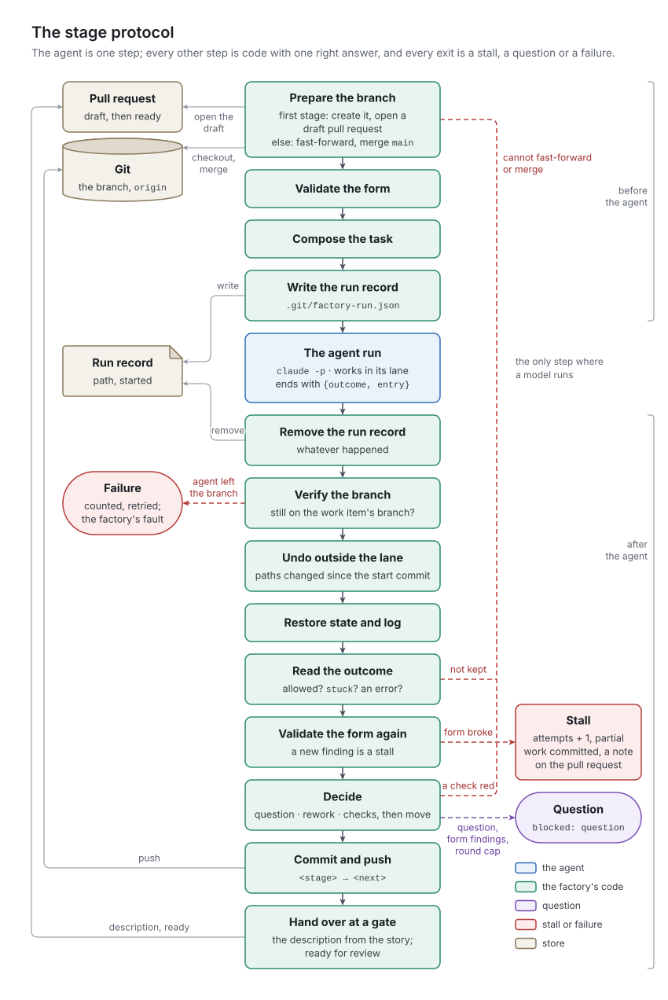

# 8. The stage protocol

[Chapter 2](../02-concepts/README.md) listed the stage protocol's steps; [chapter 5](../05-stage-machine/README.md) specified how a decision is applied. This chapter specifies the rest of what surrounds one agent run, as v1 does it.

## The concept

The protocol makes the agent's part as small as possible: the agent judges and does the stage's work, and code does every step with one right answer (P1, enforced by P10). [Chapter 2](../02-concepts/README.md) introduced its interfaces: the task, the structured outcome, the lane, the hand-over. Three properties of them matter for any implementation:

- *One source for the decisions.* The list the task shows the agent, the schema the runtime enforces, and the list the factory validates against are generated from the same place, the stage table.
- *Baselines taken at the right moment.* The lane undo and the restoration of the state fields compare the work tree with a snapshot taken after every preparation step (opening the branch, merging the main branch) and before the agent, so they undo the agent's changes and nothing else.
- *The hand-over is assembled by code*, from fixed sections of the work item and its log, so the human always finds the same sections in the same place. Agents write text that appears there; no agent writes the description.

Everything else follows from P11: the factory believes what it observes after the agent run (the branch, the files, the checks), not what the agent reports.

## In v1

`stage.run` in `src/factory/stage.py` is the protocol; `src/factory/agent.py` starts the agent.

### Before the agent

1. *Prepare the branch* (`_prepare`). The watcher's `<where>` is `main` for every `ready` and `feature` stage; what decides is whether the branch exists.
   - It does not: `_open` checks out the main branch, creates the branch, writes the six state fields (or, for an acceptance, the report's head: the fields, `stories`, and `# Acceptance of <feature title>`), commits `intake starts` or `acceptance starts`, and pushes. A pull request needs a pushed branch with a commit of its own; that is why this commit exists.
   - It does: check out the branch and pull with `--ff-only`; then fetch `origin/main` and merge it in (`merge main`); on a conflict, abort the merge. Either failure is a stall. At `ready`, the task's branch line then says `(exists; intake asked before)`, whether or not intake asked: a retry after an intake stall gets the same line.
2. *Ensure the pull request* (`_ensure_pull_request`), at every stage. Use the `pr` field; else ask GitHub for an *open* pull request of the branch (a closed one belongs to an earlier, discarded attempt); else create a draft. A story's draft is titled `<id>: <title>`, with the Assignment and the criteria as its body; an acceptance's is titled `<feature folder>: acceptance`, body `Feature acceptance in progress.`. The number goes into `pr`, committed with the stage's result.
3. *Validate the form* (`_form`), for stories only, and keep the findings ([chapter 4](../04-work-items/README.md)).
4. *Take the baselines* for the undo and the restore: the story's text, and the commit `HEAD` points to.
5. *Compose the task* (`_task`).
6. *Write the run record*, start the agent, and remove the run record in a `finally` block when the agent returns, whatever happened.

### The task

Every task has the same lines, in this order; three are conditional. For the health endpoint's second intake, after the human's answer, it read:

```text
Ticket: factory/features/F0002-operations/ongoing/F0002-S0001-health-endpoint.md
Id: F0002-S0001
Stage: ready
Allowed outcomes: tests, question, stuck
Branch: ticket/F0002-S0001-health-endpoint (exists; intake asked before)
Pull request: 35
Round: 0
Format check: passed
End with your outcome and your log entry; the factory commits, pushes and moves the story.
```

| Line | Present | Value |
| :- | :- | :- |
| `Ticket:`, `Id:`, `Stage:` | always | the path, the identifier, the stage |
| `Allowed outcomes:` | always | the stage's `next`, then `question`, `stuck` (`stage._allowed`, also the source of the schema and of the validation) |
| `Branch:` | always | the branch, with the note above for intake on an existing branch |
| `Pull request:`, `Round:` | always | the `pr` field; the `round` field |
| `Mode: a test change the human approved; the coder's entry <n> names it.` | for the tester, when the last log entry starts with `coder:` | |
| `Format check: passed`, or `Format check found: 1. … 2. ….` | for intake | the form validation's findings |
| `Archived stories: …`, `Next free story number: …`, `Cost of the stories: <n> runs, <m> min, $<x>` | for the acceptor | `_acceptor_facts` ([chapter 11](../11-feature-acceptance/README.md)) |
| `End with your outcome and your log entry; the factory commits, pushes and moves the story.` | always, last | |

### The outcome schema

`stage.schema(allowed)` is passed to the agent runtime as JSON Schema, and the runtime returns the agent's answer as structured output that conforms to it. v1's field `outcome` holds the decision:

```json
{"type": "object",
 "properties": {
   "outcome": {"type": "string", "enum": ["tests", "question", "stuck"]},
   "entry": {"type": "string", "description": "your log entry, without its number or your name: everything your stage skill says the entry contains"}},
 "required": ["outcome", "entry"],
 "additionalProperties": false}
```

### Starting the agent

`agent.load(name, home)` reads `<home>/agents/<name>.md`, where `home` is `FACTORY_CLAUDE_HOME` or `~/.claude`, and each skill it lists from `<home>/skills/<skill>/SKILL.md`. From the agent's frontmatter it takes only `model` (default `sonnet`), `tools`, `effort`, `skills` and the factory's own key `budget_usd` (default $3). The prompt it appends is the file's body followed by each skill's body under `# Skill <name>`. A missing agent or skill, or a file that is not valid YAML, starts no process: the start returns a failed result naming the missing piece, the steps after the agent run as usual, the stage stalls, and a cost record of zero is written.

`agent.command` builds one call of Claude Code, the agent runtime, in print mode. Its prompt and settings files go to `.git/factory-agent/`, outside the work tree:

| Flag | Why |
| :- | :- |
| `-p <task>` | print mode: headless, one task, then exit |
| `--model`; `--effort`, `--tools` when set | from the agent file |
| `--session-id <uuid>`, or `--resume <uuid>` | a session (Claude Code's term for one conversation) whose id the factory chooses, so it can resume it after a budget stop |
| `--append-system-prompt-file .git/factory-agent/agent-<name>.md` | the agent's text and its skills |
| `--settings .git/factory-agent/agent-<name>-settings.json` | one `PreToolUse` hook on `Edit\|Write` that runs `factory-guard <name>`, the lane guard; it adds to the user-level settings with their allow and deny lists ([chapter 9](../09-agents-and-skills/README.md)), it does not replace them |
| `--permission-mode auto`, `--permission-prompts none` | unattended: whatever the allow list does not cover goes to the runtime's classifier, and nothing ever waits for a prompt |
| `--strict-mcp-config` | no tool connectors from the login, which changed the cached prompt between calls (design decision 2026-10-05) |
| `--max-budget-usd <x>` | the agent's dollar budget, the only limit on its length besides the wall clock |
| `--output-format json`, `--json-schema <schema>` | a result the factory can parse, with the decision as structured output |

The process runs in the checkout, with the factory's own environment plus three variables (`AGENT_ENV`): `CLAUDE_CODE_DISABLE_AUTO_MEMORY=1` and `CLAUDE_CODE_DISABLE_GIT_INSTRUCTIONS=1`, which keep text out of the prompt that no stage uses, and `PYTHONDONTWRITEBYTECODE=1`, which keeps bytecode files out of the listings agents read.

`agent.run` reads the JSON result: `total_cost_usd`, `num_turns`, the token counts (input, cache reads, cache writes, output), `permission_denials`, and `structured_output`. If the result's `subtype` is `error_max_budget_usd`, it resumes the same session once, with `--max-budget-usd` set to a quarter of the budget, at least $0.50, and the message `FINISH`:

> Finish now: give your outcome (`stuck` if the work is not done) and your log entry.

The agent run succeeded when the process exited 0 and the result is not an error. Otherwise its cause is one of "timed out after *n* min", "no result from claude (exit *c*): …", "budget of $*b* spent, and the resume too", or the result's subtype and errors. Costs, turns and tokens of both calls are summed into one result, which the tick writes as one cost record ([chapter 14](../14-runtime/README.md)).

### After the agent

1. *The branch.* If the checkout is no longer on the work item's branch, raise: the agent switched branches, which the deny list is meant to prevent. This is a failure of the factory, counted and retried, not a stall.
2. *The lane undo* (`_undo_out_of_lane`). Every path changed since the start commit, in tracked files (`git diff --name-only --no-renames <start>`, which includes the coder's own commits) and in untracked files Git does not ignore, is tested against the agent's lane with the guard's own rule. Any other story in `ongoing/` is undone too, whatever the lane. An undone path that existed at the start is checked out from the start commit; a new one is deleted. The story's own file is left to the next step.
3. *The factory's parts* (`_keep_the_dispatchers_parts`). The story's frontmatter and log are reset to the baseline; the agent's changes to its sections stay. If the agent deleted the file, the baseline is restored.
4. *The result* (`_outcome`). What cannot be kept is a stall ([chapter 5](../05-stage-machine/README.md)); the stall's reason ends with the first denied tool call, if there was one: "; denied: Bash: git push …".
5. *The entry* (`_apply`). Code writes the prefix: the text becomes `<agent>: <entry>`, with any leading name or stage the agent wrote removed first. If anything was undone, a paragraph is added: "The factory undid changes outside the *agent*'s lane: *paths*".
6. *The form again.* Only a finding that was not there before the agent run stalls the stage: "the story's form broke: …", with the agent's entry kept in the log above the stall.
7. *The decision*, by the rules in [chapter 5](../05-stage-machine/README.md). A red check stalls with the last 15 lines of its output (`stage.TAIL`); each green check and each report adds a line `` `make <target>`: <last line> `` to the entry, where the last line skips `make`'s own `make: ***` and `make[…]` lines.
8. *Commit and push*: `git add -A`, so everything the agent left in the work tree is committed with the entry.

The protocol's commit subjects, after `ticket <id>:` (or `acceptance <feature folder>:`):

| Subject | When |
| :- | :- |
| `intake starts`, `acceptance starts` | the branch is opened |
| `merge main` | the main branch is merged in |
| `<stage> → <next>` | a decision is applied |
| `<stage> asks`, `<stage> asks (round cap)` | a question is recorded |
| `<stage> stalled` | a stall, after its note is posted |

v1's lanes, from `template/stages.yml`. Every lane includes the story itself, `factory/features/*/ongoing/*.md`, except the acceptor's:

| Agent | Writes besides the story |
| :- | :- |
| intake, reviewer, demo | nothing |
| tester | `tests/*` |
| coder | `src/*`, `docs/openapi.json` |
| documenter | `README.md`, `docs/*` |
| acceptor | `factory/features/*/ACCEPTANCE.md`, `factory/features/*/drafts/*.md` |

No lane reaches the files the guard reserves for the human ([chapter 12](../12-project-contract/README.md)).



*Figure 8-1. The stage protocol around one agent run: what the factory does before the agent, the agent's work inside its lane, and what the factory verifies, restores and commits afterward.*

### The hand-over

When a decision moves a work item into a stage with `gate`, `_move` commits and pushes, and `_hand_over` then replaces the pull request's description and marks it ready for review. A story's description (`_story_body`):

| Section | Content |
| :- | :- |
| `## Assignment` | the story's section |
| `## Acceptance criteria` | the story's section |
| `## Tests`, `## Review`, `## Documentation`, `## Demo` | the last log entry of the tester, reviewer, documenter and demo agent, or `none` |
| `## Commits` | `git log --oneline origin/main..HEAD`, in a code block |
| (a line) | "This is the last story of *feature*; merging completes the feature.", when the story is the only one in `ongoing/` and the feature has no drafts |
| (closing) | `STORY_CLOSING` |

`STORY_CLOSING` reads:

> Merge to accept, with a merge commit (not squash or rebase). To send it back, close it with a comment that says what should change; a close without one is answered with a question. Nobody answers comments while the story waits here: they go into the story's log and become the reason if you then close.

An acceptance's description (`_acceptance_body`) has `## Verdict` (the report's section), `## Findings in short` (the acceptor's whole entry as written to the log, notes included), `## Proposed stories` (the report's section) and `ACCEPTANCE_CLOSING`:

> Merge, with a merge commit (not squash or rebase), to accept the report and take the proposed drafts into the feature's drafts/, where you refine them before promoting any. Close, with a comment saying why, to refuse: the report stays on main as refused with your comment, the proposed drafts are discarded, and the feature counts as not accepted until another story is archived and a new acceptance runs. Nobody answers comments while the acceptance waits here; they go into the report's log.

After the agent run that reached the gate, the tick posts the cost table ([chapter 10](../10-human-at-the-gate/README.md)). The protocol's last fixed text is `CAP_QUESTION`, appended to the entry of a stage that passed its round cap, after "This story has now been sent back *n* times, more than *cap*.":

> What should happen? Answer with a comment; close the pull request to discard the story.

> [!WARNING]
> **v1 limit:** the agent files are not applied as files. Claude Code's `--agent` flag ignores an agent file in print mode: no preloaded skills, no hooks, no turn limit, and no structured output (a spike with Claude Code 2.1.289, recorded in v1's plan [`docs/archive/deterministic-core.md`](../../archive/deterministic-core.md)). So the runner reads five keys itself and turns them into flags and a prompt file. The files' other keys, `name`, `description`, `permissionMode`, `hooks`, `background` and `disallowedTools`, have no effect, although they read as if they did.

> [!WARNING]
> **v1 limit:** the lane is read from the work tree the agent can change. The guard and the undo read `lanes:` from `factory/stages.yml` in the checkout, on every call. An agent that rewrites that file from the shell, which no hook sees, widens its own lane for the rest of its agent run. The undo then walks the changed paths in sorted order and judges every path that sorts before `factory/stages.yml` (`README.md`, `docs/…`, `factory/features/…`) by the widened lane, before it restores the file itself. A rewrite that is not valid YAML makes the undo raise.

> [!WARNING]
> **v1 limit:** the undo and the restore run only when the protocol completes. They see only the work tree's tracked and unignored files: a write to an ignored path, or outside the checkout, is never undone ([chapter 15](../15-safety/README.md)). After a kill, or any raise after the agent (the branch test, the YAML error above), the next tick's `tick.recover_dirty_tree` commits whatever is in the work tree with `git add -A`: out-of-lane writes, and the agent's edits to the frontmatter and the log, survive into the history ([chapter 14](../14-runtime/README.md)). After a branch switch they land on whatever branch is checked out. And an out-of-lane change the coder committed itself stays in the history, reverted by the factory's next commit.

> [!WARNING]
> **v1 limit:** the hand-over is not retried. `_move` pushes the stage change before `_hand_over` writes the description. If GitHub fails then, the tick counts a failure, but the work item is already at the gate, so the `run` event never returns: the pull request stays a draft with its first description, no cost table is posted, and nothing tells the human.

> [!WARNING]
> **v1 limit:** each `claude` call, and each `make` call of a check or report, gets the full lease as its timeout. A stage can therefore take two leases for the agent, plus one per check, while its run record expires after one. Only the sequential loop keeps that harmless: the lock of a running tick goes stale only after the lease plus 10 minutes, and no second tick starts in the meantime.

Agents run with the factory's whole environment, its GitHub token included; [chapter 15](../15-safety/README.md) states that limit.

> [!IMPORTANT]
> **Planner:** what this chapter fixes.
> - **Essential:**
>   - the dependencies that make the protocol correct: the baselines are taken after every preparation commit and before the agent, or the undo would revert the merge of the main branch; findings exist before the task is composed; the run record is removed whatever happens; the branch is verified before anything is written;
>   - the allowed decisions come from one source, the stage table, for the task, the schema and the validation;
>   - the lane is enforced twice, the second time against the start commit, covering shell writes; any other story is undone whatever the lane;
>   - code writes the log prefix and strips the agent's own; only new form findings stall;
>   - only an open pull request is reused;
>   - the description is assembled by code from fixed sections of the story and its log; no agent writes it.
> - **Incidental to v1:** Claude Code's flags; the budget resume; the environment switches; the task's exact wording.
> - **Watch for:**
>   - take the lanes from the start commit or the factory's configuration, never from the work tree the agent can change;
>   - run the agent in a sandbox where a write outside the work tree is impossible, rather than undone afterward;
>   - apply the undo and the restore to leftovers too, whatever ended the agent run;
>   - make the hand-over idempotent and retry it from the work item's state;
>   - one limit on a stage's wall clock, counted across resumes and checks, that matches the run record's lease;
>   - say in intake's task only what is true: an answer, or a retry;
>   - an agent definition whose every key has an effect, validated at load time; the agent runtime behind one module, `agent.py` in v1.
