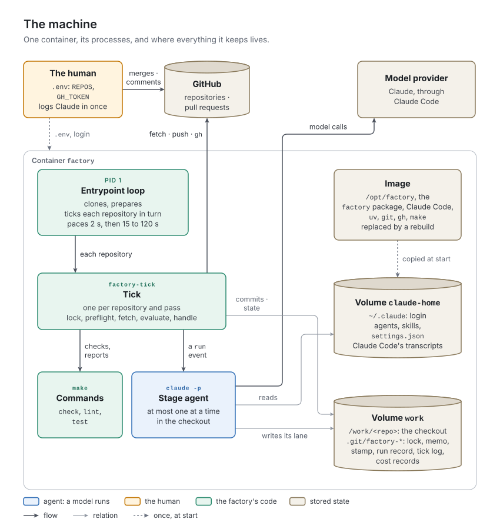

# 14. The runtime

Part II specified what one tick decides and does. This chapter specifies what runs the ticks: the machine, the scheduler, the tick's own steps around the watcher and the dispatcher, the preflight, every file the factory keeps outside version control, and the records that tell what the factory did and what it cost.

## The concept

The **runtime** is everything around the control loop that is not the project: a machine with the tools, the agent runtime and the credentials ([chapter 2](../02-concepts/README.md)); its own checkout of each project; a scheduler that paces by events (P13); and the state that lives outside version control. Its stops must reach the human like any other (P12).

That state falls into four classes, and an implementation should know which is which:
- *Disposable* state, such as the tick's lock and memo, may be deleted whenever no process holds it, as at a start; at worst something is tried again.
- *Evidence*, such as the run record of a killed agent run or a commit the factory could not push, must survive a restart: it is how the factory learns what was interrupted.
- *Accounts*, such as the cost records, are needed until their content reaches version control; P2 and P16 meet there ([chapter 3](../03-principles/README.md) lists the tension as open).
- *Credentials and diagnostics*, such as the agent runtime's login and its transcripts, must survive a rebuild of the machine and must never reach an agent ([chapter 15](../15-safety/README.md)).

## In v1

### The image and the container

[`Dockerfile`](../../../Dockerfile) builds the machine:

| Layer | Content |
| :- | :- |
| *Base* | `python:3.12-slim-bookworm`; `git`, `make`, `curl`, `ca-certificates`, `procps`, `gnupg` from Debian; `gh` from GitHub's own package repository |
| *`uv`* | pinned, 0.9.2, copied from its image |
| *User* | `factory`, uid 1000, home `/home/factory`; `/work` created for it |
| *Environment* | `~/.local/bin` on the `PATH`; `UV_LINK_MODE=copy`; `CLAUDE_CODE_FORK_SUBAGENT=0` |
| *Claude Code* | the native installer, version `ARG CLAUDE_VERSION`, by default `latest` |
| *The factory* | the repository copied to `/opt/factory`; `uv tool install /opt/factory`, which puts `factory-tick`, `factory-watch`, `factory-guard`, `factory-costs`, `factory-preflight` and `factory-check-story` on the `PATH`; `claude/skills`, `claude/agents` and `claude/settings.json` copied into `~/.claude` ([chapter 9](../09-agents-and-skills/README.md)) |
| *Volumes, entrypoint* | `~/.claude` and `/work`; `/opt/factory/entrypoint.sh` |

[`compose.yml`](../../../compose.yml) runs one service, `factory`, with `restart: unless-stopped`, the volume `claude-home` on `~/.claude` (the login and Claude Code's transcripts, beside the agents and skills) and `work` on `/work` (the checkouts). Its settings come from the environment, usually a `.env` file:

| Variable | Default | Meaning |
| :- | :- | :- |
| `REPOS` | required | `owner/name` of each project, comma-separated |
| `GH_TOKEN` | required | the token of [chapter 13](../13-git-and-github/README.md) |
| `TICK_FIRST_SECONDS` | 15 | the pause after the first idle pass that follows activity |
| `TICK_SECONDS` | 120 | the longest pause |
| `GIT_USER_NAME`, `GIT_USER_EMAIL` | `factory`, `factory@noreply.invalid` | the commit identity; an address that matches no GitHub account |

Claude Code is logged in once, interactively: `docker compose run --rm -it --entrypoint claude factory`. The login stays in `claude-home`. It is a subscription login, so the dollars in the cost records are Claude Code's computed list prices, not a bill.



*Figure 14-1. The machine: one process chain in one container, three places with different lifetimes, and the two services outside it.*

### The entrypoint

[`entrypoint.sh`](../../../entrypoint.sh) is the scheduler:

1. Stop unless `REPOS` and `GH_TOKEN` are set.
2. Copy the agents, skills and `settings.json` from `/opt/factory/claude/` into `~/.claude`.
3. Set Git's identity and `pull.ff only` globally; run `gh auth setup-git`.
4. Export `FACTORY_STARTED_AT`, the start time in UTC. Trap `TERM` and `INT` to exit. Bash runs the trap only when its foreground command returns, so the trap ends an idle pause at once, but a tick that is running is killed with the container when `docker stop` gives up after ten seconds.
5. In every checkout, delete `factory-tick.lock`, Git's `index.lock` and the tick's memo `factory-tick.json`: nothing has run yet, so any lock belongs to a killed process. The run record stays: it is the evidence.
6. Loop forever. For each repository in `REPOS`, in order, *prepare* it, then run `factory-tick` in `/work/<name>`. If any tick exited with 3, sleep 2 seconds and reset the pause to `TICK_FIRST_SECONDS`; otherwise sleep the pause and double it, up to `TICK_SECONDS`.

*Prepare* clones a missing checkout with `gh repo clone`. While the main branch has no `factory/stages.yml`, it fetches and fast-forwards `main` itself, because the tick cannot run without the stage table. It reports a repository that is not ready once per reason ("the repository is still empty", "main has no factory/stages.yml yet …", "uv sync --frozen failed") and "*repo* is ready" when it is. The first time a repository is ready after the container starts, and only if it has a `pyproject.toml`, it runs `uv sync --frozen`.

### The tick

`tick.tick` runs around the watcher ([chapter 6](../06-watcher/README.md)) and the dispatcher ([chapter 7](../07-dispatcher/README.md)):

1. *Load the stage table.*
2. *Lock.* Create `factory-tick.lock` exclusively, holding the time. If a lock exists and is younger than `lease_minutes` + 10 minutes, return 0 at once. An older lock belongs to a dead tick and is removed.
3. *Preflight*, unless its stamp is fresh (below). A failure logs "preflight failed: …" and returns 1; no stamp is written, so the next tick runs the preflight again.
4. *Recover a dirty tree.* If `git status --porcelain` shows changes and the checkout is on a `ticket/` or `acceptance/` branch, commit them as `<prefix> <id>: work left uncommitted by an interrupted run` and push, ignoring a push failure. On any other branch, log "working tree is dirty on main; a human needs to look before the loop goes on" and return 1.
5. *Fetch* and *fast-forward `main`* ([chapter 13](../13-git-and-github/README.md)).
6. *Evaluate*, with `outlived_claim` ([chapter 6](../06-watcher/README.md)).
7. *Decide* with `needs_handling` and `only_own_comments`, and *handle* with `handle_line` ([chapter 7](../07-dispatcher/README.md)); with `--dry-run`, log "would dispatch: *event*" instead.
8. *Release the lock*, in a `finally` block.

The scheduler reads exit 3 as "tick again at once" and treats 1 like 0. `factory-tick` takes `--root`, `--dry-run` and `--claude` (the agent runtime's command, also `FACTORY_CLAUDE`).

### The preflight

`factory-preflight` (`src/factory/preflight.py`) prints one line per item, `ok <name>` or `missing <name>: <fix>`, and exits 1 if anything is missing:

| Item | Passes when | Fix offered |
| :- | :- | :- |
| `git`, `gh`, `uv`, `make` | on the `PATH` | an install command for Windows, macOS, apt, dnf or other systems |
| `git identity` | `user.name` and `user.email` are set | `git config --global …` |
| `gh auth` | `gh auth status` succeeds | `gh auth login` |
| `venv` | the checkout has a `.venv` folder | `uv sync` |
| `shell tools` | `sh`, `grep`, `rm`, `touch` are on the `PATH` | Git Bash on Windows, coreutils elsewhere |
| `agents` | every agent the stage table names has a file in `~/.claude/agents/` | rebuild the image, or change the stage table |
| `make lint` | the probe succeeds; run only when every item above passed (`--no-gate` skips it) | read its output |

An item whose tool is missing counts as missing too, and every item runs, so one preflight names everything at once. Nothing is installed and nobody is asked: the fixes go into the tick log. (The module's docstring still says the dispatcher "may offer to run" them, as in generation 2.) The `agents` item checks neither the skills nor the files' validity, which `agent.load` does at the agent run, and it reads `~/.claude` even where `FACTORY_CLAUDE_HOME` points elsewhere.

After a pass the tick writes the stamp `factory-preflight-ok`: the factory's package version and the first 12 hex digits of the SHA-256 of `factory/stages.yml`. Both are in it so that a new version or a changed stage table runs the preflight again (design decision 2026-10-04); the stamp is fresh for 24 hours while both match. The version is the one set by hand in `pyproject.toml`, `5.0.0` at `930c61a`, so a rebuilt image does not renew the stamp unless the version changed; a changed stage table does.

### Machine state

Everything lives under the checkout's `.git/`, which Git never tracks, in the `work` volume:

| File | Written by | Content | Cleared |
| :- | :- | :- | :- |
| `factory-tick.lock` | the tick | the time it was taken | at the end of every tick; at start |
| `factory-tick.json` | the tick | the memo ([chapter 7](../07-dispatcher/README.md)) | at start |
| `factory-preflight-ok` | the tick | the stamp | replaced after 24 hours or a change |
| `factory-run.json` | the stage protocol | the run record ([chapter 6](../06-watcher/README.md)) | when the agent returns; by `expired` |
| `factory-agent/` | the agent starter | each agent's prompt and settings file ([chapter 8](../08-stage-run/README.md)) | overwritten per agent run |
| `factory-tick.log` | the tick | the tick log | never |
| `factory-dispatches.jsonl` | the tick | the cost records | never |
| `factory-last-line` | `factory-watch --follow` | the last event printed | never; nothing in v1 calls `--follow` |

### Cost records

After every handled event that started an agent, `tick.record` appends one JSON line to `factory-dispatches.jsonl`. The health endpoint's tester, as run 4 recorded it:

```json
{"time": "2026-10-05T18:59:01Z", "line": "run tester factory/features/F0002-operations/ongoing/F0002-S0001-health-endpoint.md ticket/F0002-S0001-health-endpoint", "ok": true, "seconds": 41, "turns": 7, "cost": 0.34501919999999997, "input": 12, "cache_read": 127336, "cache_write": 31343, "output": 3438}
```

`line` is the event; `ok` says whether the agent run ended without an error from the agent runtime. A stall on a red check or a `stuck` decision is `ok: true`; a timeout, an unreadable result, an exhausted budget and resume, or a missing agent is `ok: false`. The record carries no session id, so it cannot be joined to the agent's transcript in `claude-home`.

`costs.buckets` selects the records whose event names the work item's path, *with `ok: true` only*, and groups them by the agent named in the event (`dispatcher` for any other event, which only generation 4's records contain). From the buckets come the cost table posted at the gate ([chapter 10](../10-human-at-the-gate/README.md)), the cost line in the `done` entry of an archive or a refusal ([chapter 4](../04-work-items/README.md)), and `factory-costs <path>`, which prints both. The acceptor's sum is not from the records: `stage._acceptor_facts` parses the cost lines in the archived stories' logs ([chapter 11](../11-feature-acceptance/README.md)), so it lives in Git.

### What the human sees of the machine

The container's output (`docker compose logs`) holds the entrypoint's lines, without time stamps (`factory ticking on … doubling to …`, `cloning …`, `waiting for …`, `… is ready`, `factory stopping`), a crashing tick's traceback, and the tick log, which the tick also appends to `factory-tick.log`, the factory's log file. Every tick log line starts with a UTC time stamp:

| Line | When |
| :- | :- |
| `dispatch: <event>` | a handler starts |
| `done: <summary> (turns=… cost=$… seconds=… tokens=<new>+<cached>cached/<out>out)` | it succeeded; the part in brackets only after an agent run |
| `failed (<n>/3): <summary> …` | it raised or failed |
| `giving up: …`; `could not report on pull request <n>: …` | the third failure |
| `posted the cost table on pull request <n>`; `could not post the cost table: …` | after the agent run that reached the gate |
| `committed leftovers of an interrupted run on <branch>` | step 4 |
| `main fast-forwarded to origin/main`; `main could not fast-forward …` | step 5 |
| `preflight failed: …`; `working tree is dirty on main; …` | steps 3 and 4 |
| `would dispatch: <event>` | `--dry-run` |

The board, `factory-watch --board` run inside the container, shows every feature and work item ([chapter 6](../06-watcher/README.md)). The container has no health check, so `docker compose ps` says "running" while every tick fails.

### Changes made on measured grounds

Three changes after run 4 came from reading the cost records and the agents' transcripts in `claude-home`, not from a failure. *The pause:* every story of run 4 waited out the full two minutes three times; the pause now starts at 15 seconds after activity (above). *Connectors:* the login's claude.ai connectors changed the start of every agent run's request after its first call, so the cached prefix was written again; `--strict-mcp-config` went in ([chapter 8](../08-stage-run/README.md)). *Fewer turns:* every model call re-reads the whole conversation, so the stage skills were changed to read less and chain commands ([chapter 9](../09-agents-and-skills/README.md)). All three are design decisions of 2026-10-05; [chapter 16](../16-evidence/README.md) has the measurements, and no full run has measured the effect of the last two yet.

> [!WARNING]
> **v1 limit:** one machine does one thing at a time. The entrypoint ticks its repositories one after another, and a tick waits for its agent run, which may take two leases plus one per check ([chapter 8](../08-stage-run/README.md)). A coder working on one project holds up questions, merges and answers in every other. v1 has no setup for a second machine; the design decision of 2026-10-04 planned one service per repository, on a NAS.

> [!WARNING]
> **v1 limit:** two repositories with the same name under different owners share a checkout: `entrypoint.sh` uses `/work/${repo##*/}`.

> [!WARNING]
> **v1 limit:** the bill misses agent runs. `tick.record` writes after the handler returns, so an agent run killed by a restart leaves no record, and neither does one whose handler raised afterward (a branch test, a rejected push, a failed hand-over), because the exception discards the result. `costs.buckets` counts only `ok: true`, so every agent run that ended in an error is missing from the cost table and the `done` entry, among them the most expensive kind, one that spent its whole budget and then the resume's; a timeout or an unreadable result is recorded with a cost of zero although it spent money. (Run 4's records contain no failed agent run.) Records are keyed by the path in `ongoing/`, so a story discarded and promoted again carries the bill of its first attempt.

> [!WARNING]
> **v1 limit:** the records live and die with the `work` volume. `docker compose down -v`, a lost disk or a fresh demonstration run deletes the cost records and the tick log; the bill of every work item not yet archived is gone, and so is the record of every agent run. Run 4's records survive only because they were copied out by hand. Neither file is ever rotated, nor are the transcripts in `claude-home`.

> [!WARNING]
> **v1 limit:** the machine's own stops never reach a pull request (P12). A failed preflight and a dirty main branch reach the tick log (`tick.tick`, steps 3 and 4); a repository the entrypoint waits for (`prepare`) and an invalid stage table, which makes every tick of that repository crash in `watch.load_config` before its lock, reach only the container's output, which a recreated container loses. A tick killed alone (by the out-of-memory killer, say) leaves its lock, and the repository then waits `lease_minutes` + 10 minutes, 70 with the template's lease, unless the container restarts.

> [!WARNING]
> **v1 limit:** the preflight's probe judges the code, not only the machine. `preflight.gate_check` runs `make lint` on whatever branch is checked out, and a question (`stage._ask`) or a stall (`ops.stall`) commits the agent's work as it is: a coder that asks halfway, with code that fails the lint, leaves the checkout on a branch where the probe fails. If the stamp expires while the story waits, every tick fails at the preflight, runs `make lint` again, and never reaches the human's answer. A fix pushed to GitHub does not help, because the tick fetches only after the preflight; the branch must be fixed in the container's checkout. The preflight also runs before the dirty-tree recovery, so a killed agent's uncommitted edits are probed too. v1 chose `make lint` over `make check` because a branch "may be red on purpose" (design decision 2026-10-04), which holds for red tests, not for code that fails the lint. A main branch that fails the lint stops the repository the same way, before its first story.

> [!WARNING]
> **v1 limit:** the machine is not reproducible. The Dockerfile pins only `uv` ("Pin what the loop depends on"); Claude Code is installed as `latest` (`ARG CLAUDE_VERSION=latest`), the base image, the Debian packages and `gh` float too, and `uv tool install /opt/factory` is not told to use the repository's `uv.lock`, so the factory's own dependencies are resolved afresh at every build, while the factory depends on Claude Code's flags, its JSON result and its permission behavior, and parses `gh`'s JSON. `--max-turns` had already disappeared once (design decision 2026-10-05). The container built on 2026-10-05 at 20:59 UTC has Claude Code 2.1.289.

> [!IMPORTANT]
> **Planner:** what this chapter fixes.
> - **Essential:**
>   - a machine of its own for agents, holding every tool the project's checks need, checked by a preflight that reports and never installs;
>   - a scheduler that ticks on events, with a short pause after activity and a growing one while idle;
>   - the four classes of machine state: disposable state cleared at start; evidence kept and read against the start time; accounts kept until they reach version control; credentials and diagnostics kept across rebuilds and out of the agents' reach;
>   - one cost record per agent run that started, attributable to a work item, a stage and the agent runtime's transcript.
> - **Incidental to v1:** Docker and Compose, the bash loop, the file names under `.git/`, the exit codes, the stamp's 24 hours, the 2-, 15- and 120-second pauses.
> - **Watch for:**
>   - any condition that keeps a repository from progressing for more than a few ticks, a crashing tick included, is posted where the human looks;
>   - write the cost record when the agent run starts and complete it when it ends; count failed agent runs; commit the cost into the work item as it accrues, so the bill survives the machine (P2);
>   - a stop of the machine lets a running agent run finish, or records it as interrupted;
>   - probe the machine on the main branch or in a clean worktree, never on a work item's branch, and key the stamp to the image's build, not a version set by hand;
>   - more than one agent run per machine needs a checkout per agent run (P5 in [chapter 3](../03-principles/README.md));
>   - pin the agent runtime and the base image, and test the agent runtime's interface in the preflight;
>   - a health signal the container platform can read.
